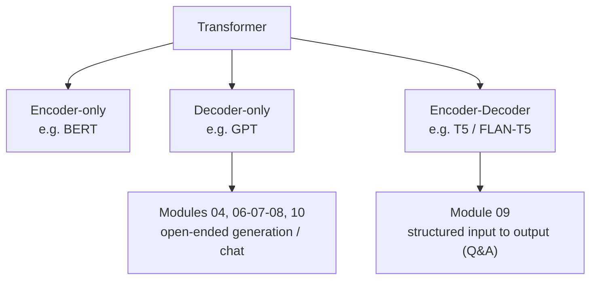

# Transformers & LLMs — Part 1: Architectures and Evaluation

This module is theory-only — it lays the vocabulary the rest of the course builds
on. Full definitions live in the source notes:
[`transformers_architectures.md`](./transformers_architectures.md) (architecture families) and
[`metrics_to_evaluate_llms.md`](./metrics_to_evaluate_llms.md) (evaluation metrics). This README is just
the map of where each concept actually gets used later in the course.

## Architecture → module

| Family | Used by | As |
|---|---|---|
| Decoder-only (GPT) | [Module 04](../04-transformers-and-llms-p2/README.md) | `GPT2LMHeadModel` for text generation |
| Decoder-only (Llama-2) | [Module 06-07-08](../06-07-08-transfer-learning-fine-tuning/README.md) | QLoRA fine-tuning for sentiment-as-generation |
| Decoder-only (Falcon) | [Module 10](../10-customer-service-bot/README.md) | QLoRA fine-tuning for a support chatbot |
| Encoder-Decoder (T5) | [Module 09](../09-legal-assistant-llm-finetuning/README.md) | FLAN-T5 fine-tuned for legal Q&A |
| Encoder-only (BERT) | — | Covered conceptually only; not implemented in this course |

No module picks an architecture arbitrarily — decoder-only fits pure continuation/chat, encoder-decoder
fits "transform this input text into different output text."

## Metric → module

| Metric | Category | Applied in |
|---|---|---|
| Accuracy / Precision / Recall / F1 / ROC-AUC / PR-AUC | Classification | Conceptually in [module 06-07-08](../06-07-08-transfer-learning-fine-tuning/README.md), where a fine-tuned model produces a `Positive`/`Negative` label as generated text rather than through a classification head |
| Perplexity | Generation | Not directly computed in this course — intrinsic measure, no reference text needed |
| BLEU | Generation | [Module 10](../10-customer-service-bot/README.md#6-evaluation--bleu) — full worked interpretation with real results |
| ROUGE | Generation | [Module 09](../09-legal-assistant-llm-finetuning/README.md#3-evaluation-metric--rouge) — full worked interpretation with real results |
| Word Error Rate / Token Cost | Generation | Covered conceptually only; not implemented in this course |
