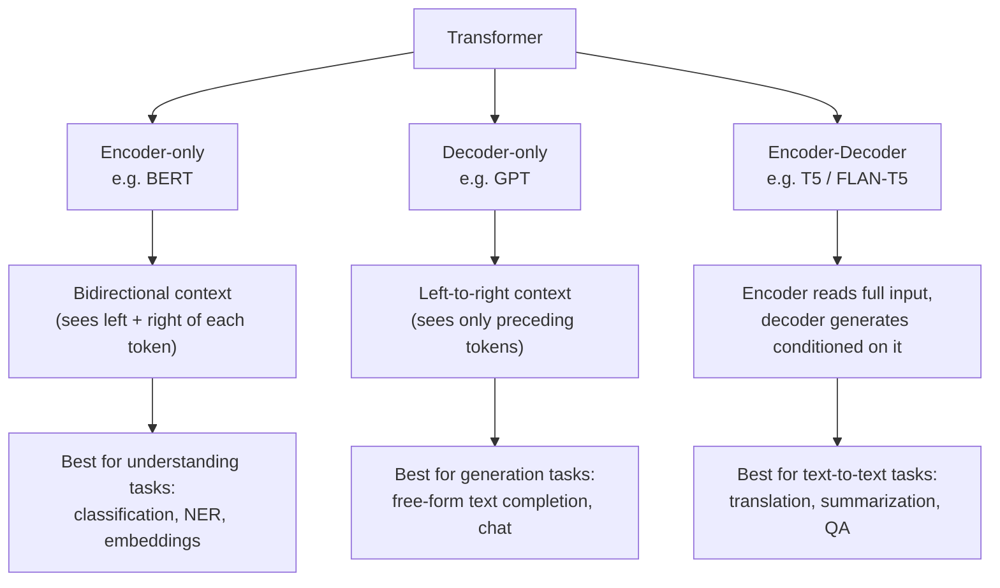

# Transformers & LLMs — Part 1: Architectures and Evaluation

This module is theory-only (no notebook/project) — it lays the vocabulary the rest of the course builds
on: which Transformer architecture family a model belongs to, and which metric family is appropriate for
judging its output. Source notes: `transformers_architectures.md`, `metrics_to_evaluate_llms.md`.

## Transformer Architecture Families

- **BERT (encoder-only)** attends to context on both sides of a token simultaneously, which is what makes
  it strong at tasks where *understanding* the whole sequence matters more than producing new text —
  sentiment classification, named entity extraction, embeddings for retrieval.
- **GPT (decoder-only)** only ever attends to what came before the current token (causal/autoregressive
  attention), because its job is to predict the next token — the same mechanism used at inference time to
  generate text one token at a time. This module's companion notebook module
  ([04](../04-transformers-and-llms-p2/README.md)) uses `GPT2LMHeadModel` directly for this reason.
- **Encoder-Decoder** combines both: an encoder builds a representation of the full input, and a decoder
  generates output tokens conditioned on that representation plus what it has generated so far. This
  family doesn't get a dedicated notebook in this module, but it's exactly what
  [module 09](../09-legal-assistant-llm-finetuning/README.md) fine-tunes (FLAN-T5) for legal Q&A — an
  encoder-decoder is the natural fit whenever the task is "transform this input text into different output
  text" rather than pure continuation.

The architecture choice isn't arbitrary — it constrains what the model is good at, which is why later
modules pick GPT-family models for open-ended generation/chat (04, 06-07-08, 10) and T5 for structured
input→output transformation (09).

## Evaluating LLMs

Evaluation metrics split into two groups: general classification metrics (reused from traditional ML,
useful whenever an LLM's output can be reduced to a discrete label) and metrics specific to *generated
text*, where there's no single "correct" output to match exactly.

| Category | Metric | Measures |
|---|---|---|
| Classification | **Accuracy** | Fraction of correct predictions overall |
| Classification | **Precision** | Of everything predicted positive, how much actually was |
| Classification | **Recall** | Of everything actually positive, how much was caught |
| Classification | **F1-Score** | Harmonic mean of precision and recall — a single balance point between the two |
| Classification | **ROC-AUC / PR-AUC** | Ranking quality across all thresholds; PR-AUC is preferred when classes are imbalanced |
| Generation | **Perplexity** | How well the model's predicted probability distribution matches the actual data — lower is better; an intrinsic measure that doesn't need a reference text |
| Generation | **BLEU** | Precision-style n-gram overlap between generated and reference text |
| Generation | **Word Error Rate (WER)** | Edit distance (substitutions/insertions/deletions) between a generated and a reference sequence |
| Generation | Token Cost | Practical/operational metric — how many tokens (and therefore $) a generation consumes |

Two of these get a full treatment with worked examples once there's an actual project to apply them to:
BLEU in [module 10](../10-customer-service-bot/README.md) (customer-service bot) and **ROUGE** — BLEU's
recall-oriented sibling, not listed above because it's introduced directly in that module — in
[module 09](../09-legal-assistant-llm-finetuning/README.md) (legal assistant). The classification metrics
above resurface conceptually in [module 06-07-08](../06-07-08-transfer-learning-fine-tuning/README.md),
where a fine-tuned model produces a `Positive`/`Negative` label as generated text rather than through a
dedicated classification head.
