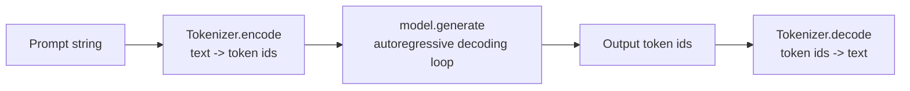
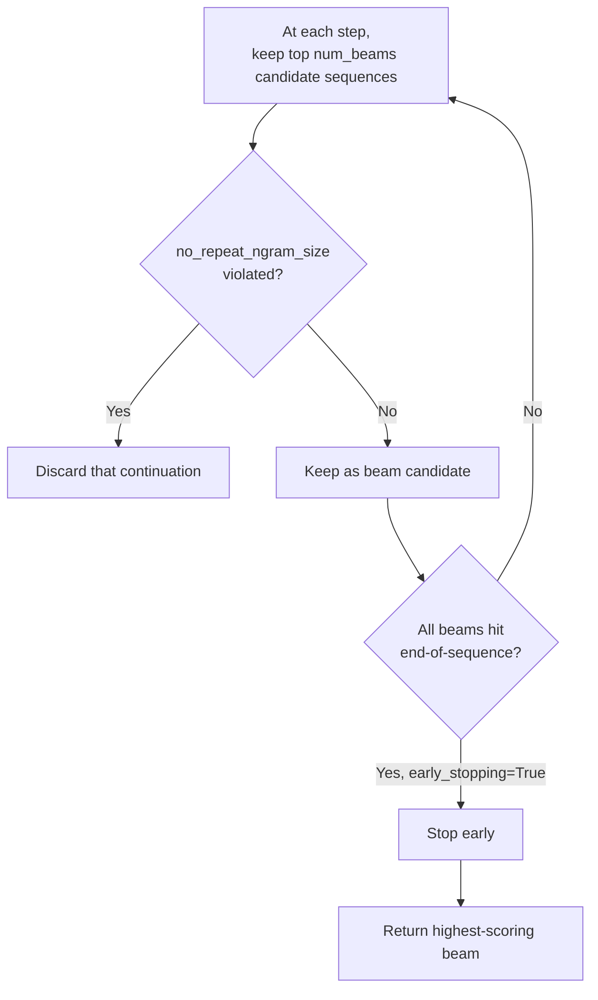

# Transformers & LLMs — Part 2: Text Generation with GPT-2

**Base model:** [gpt2-large](https://huggingface.co/gpt2-large) — a decoder-only GPT model (see
[module 03](../03-transformers-and-llms-p1/README.md) for why decoder-only architectures suit generation).

This module is the first hands-on look at autoregressive text generation, with no fine-tuning involved —
just loading a pretrained GPT-2 and driving its `.generate()` API. Two notebooks cover the same exercise:
`dsa_EstudoCaso.ipynb` (course-provided) and `text_generation.ipynb` (the same flow, reproduced
independently). Both boil down to the same pipeline.

## Pipeline Overview

## 1. Tokenizer and Model

`GPT2Tokenizer` and `GPT2LMHeadModel` are both loaded from the same `gpt2-large` checkpoint — the "LM
Head" in the model class name is the linear layer on top of the decoder stack that projects hidden states
back into vocabulary-sized logits, i.e. what turns the Transformer's internal representation into "next
token probabilities."

GPT-2 has no dedicated padding token, so the tokenizer's end-of-sequence token id is reused as the pad
token id when the model is constructed. This matters even for single-prompt generation because the model
needs *some* defined pad id to handle batched inputs or generation internals consistently.

## 2. Encoding

The prompt is encoded into a tensor of token ids before it can be fed to the model — the raw text has no
meaning to the model until each token is mapped to the integer id it was assigned during GPT-2's own
pretraining vocabulary construction. Decoding a token id back to text later only makes sense relative to
that same vocabulary, which is why (as in every other module) the tokenizer and model must come from the
same checkpoint.

## 3. Generation Strategy

`model.generate(...)` is called with a specific decoding configuration rather than the simplest possible
one (greedy, always pick the single highest-probability next token):

- **Beam search** (`num_beams=5`) explores several candidate continuations in parallel instead of
  committing greedily to the single most likely next token at every step — it trades compute for text
  that reads more globally coherent, since a locally-suboptimal token can still lead to a better full
  sequence.
- **`no_repeat_ngram_size=2`** forbids any repeated 2-gram in the output, a common patch for the
  degenerate repetition loops that plain beam search is prone to.
- **`early_stopping=True`** stops the search once every beam has produced an end-of-sequence token, rather
  than always running to `max_length`.
- **`max_length=100`** caps the *total* sequence length, prompt included — not just the newly generated
  portion.

## 4. Decoding

The generated tensor is a sequence of token ids, not text — it has to be passed back through the same
tokenizer's `decode` method, with `skip_special_tokens=True` to strip out control tokens (like the
padding/eos token reused earlier) that aren't meant to appear in human-readable output.

---

This "load pretrained model → generate → decode" pattern is the base case that later fine-tuning modules
build on top of: [module 06-07-08](../06-07-08-transfer-learning-fine-tuning/README.md) and
[module 10](../10-customer-service-bot/README.md) still end in a `.generate()` call structured just like
this one — the difference is everything that happens to the model's weights *before* that call.
