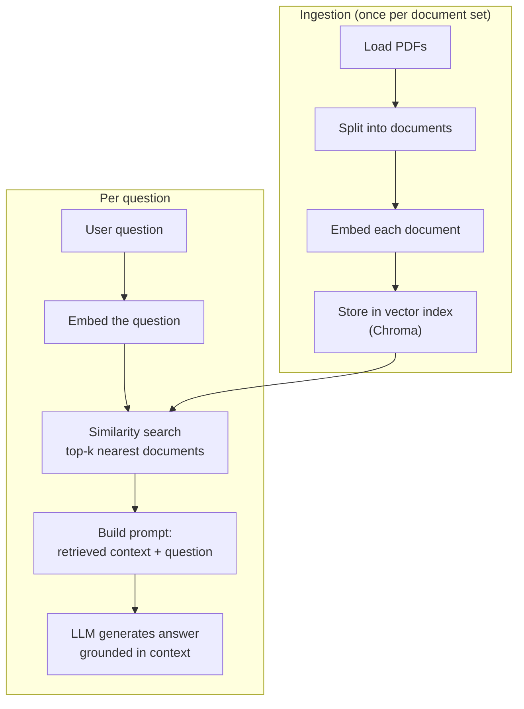
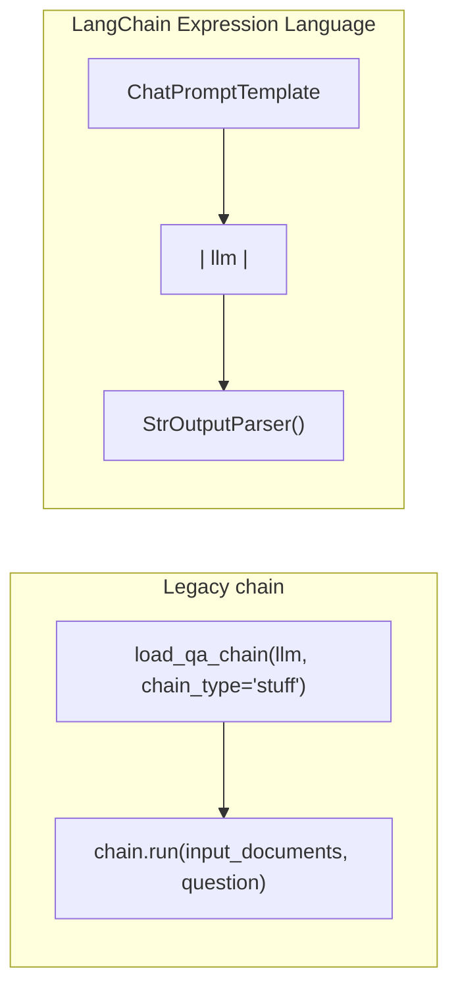

# Prompt Engineering & RAG — Chatting with Your PDFs

This module builds a RAG (Retrieval-Augmented Generation) assistant that answers questions from a set of
PDFs. Theory lives in the source notes:
[`prompt_engineering_basics.md`](./prompt_engineering_basics.md) (how to phrase prompts effectively) and
[`vector_databases.md`](./vector_databases.md) (why embeddings + a vector store enable retrieval). This
README covers how the pipeline is actually built and wired up.

## Pipeline Overview

## 1. Loading and Embedding Documents

PDFs are loaded directory-wide (`PyPDFDirectoryLoader`) rather than file-by-file, producing one document
object per page. Each document is then converted to an embedding vector — `OpenAIEmbeddings` or
`GoogleGenerativeAIEmbeddings` — and stored in a **Chroma** vector index. The embedding model
choice matters more than it might seem: the question is embedded with the *same* model at query time, so
retrieval quality depends entirely on that model placing questions and answers about the same topic near
each other in vector space.

## 2. Retrieval

`index.similarity_search(query, k)` embeds the incoming question and returns the `k` nearest stored
documents. `k` is a tradeoff knob: too small risks missing the passage that actually contains the answer,
too large dilutes the prompt with irrelevant context and wastes tokens.

## 3. Augmented Generation — Two Ways to Wire It

The same idea — "answer using only the retrieved context" — can be wired up with either of two LangChain
styles, reflecting how the library evolved:

- The legacy approach uses `load_qa_chain(..., chain_type="stuff")` — the "stuff" strategy simply
  concatenates ("stuffs") all retrieved documents directly into the prompt template in one shot. It's the
  simplest chain type, appropriate as long as the retrieved context fits comfortably in the context window.
- The **LCEL** (LangChain Expression Language) approach builds the equivalent behavior explicitly: a
  prompt template piped (`|`) into the chat model, piped into an output parser that extracts plain text
  from the model's response object. This compositional style makes each stage of the chain visible and
  swappable, which is why it has largely superseded the older `Chain` subclasses like `load_qa_chain`.

In both cases, the retrieved context and the user's question are the only two inputs the final prompt
template needs — everything upstream (loading, embedding, indexing, retrieving) exists purely to produce
that context string.
