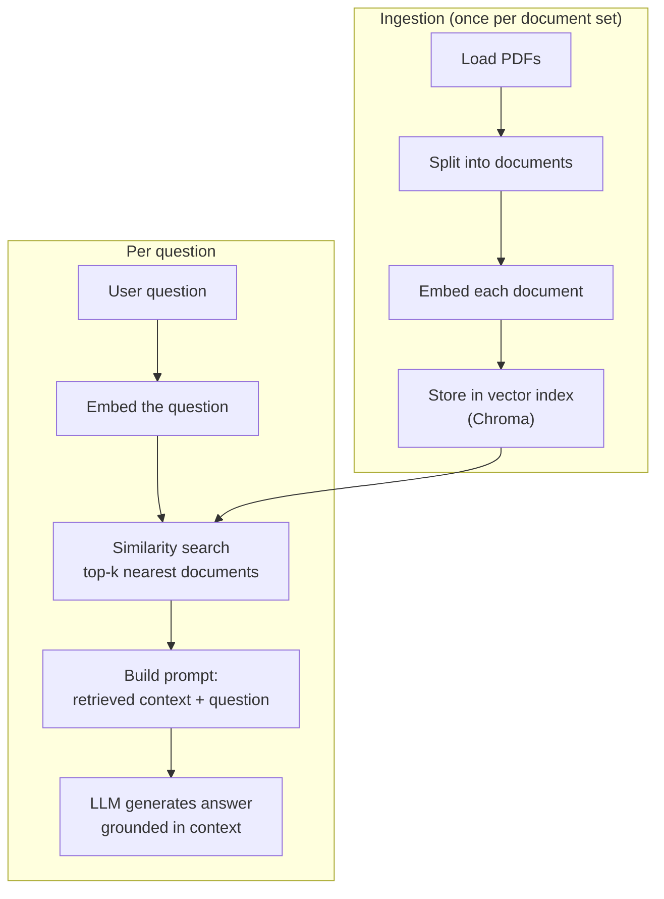
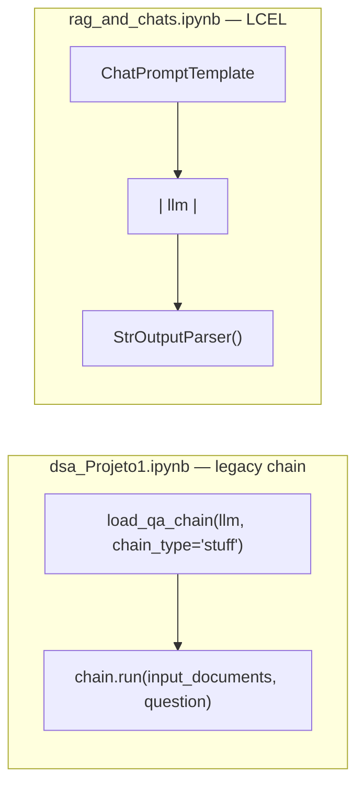

# Prompt Engineering & RAG — Chatting with Your PDFs

This module covers two related ideas: how to phrase prompts effectively (`prompt_engineering_basics.md`),
and how to ground an LLM's answers in your own documents via Retrieval-Augmented Generation, backed by a
vector database (`vector_databases.md`). Two notebooks build the same RAG assistant with different stacks:
`dsa_Projeto1.ipynb` (course-provided, OpenAI) and `rag_and_chats.ipynb` (reproduced with Gemini and a more
modern LangChain chain style) — both are referenced throughout as `[dsa]` and `[own]` respectively.

## Prompt Engineering Basics

Prompt engineering is about controlling what a general-purpose model does *without* changing its weights —
everything downstream (RAG, and even the fine-tuning modules' prompt/instruction formatting) still depends
on getting this right. The core strategies:

- **Be specific and concise** — vague prompts leave more room for the model to guess wrong.
- **Provide context** — extra relevant information narrows down which of the model's many possible
  "modes" it should respond in.
- **Use examples** — showing the model the shape of a good answer is often more reliable than describing
  it abstractly.

The underlying challenge is that no single prompt formulation transfers perfectly across models or tasks —
different LLMs interpret the same prompt differently, so prompts need iteration, and there's a constant
tension between being detailed enough to constrain the output and open enough to let the model actually do
useful work.

## Why RAG

An LLM's knowledge is frozen at training time and limited to its context window — it cannot answer
questions about a private PDF it has never seen. **Retrieval-Augmented Generation** works around this
without retraining anything: relevant chunks of your own documents are retrieved at query time and
inserted directly into the prompt as context, so the model answers from text it can actually see, not from
memorized (and possibly outdated or hallucinated) knowledge.

### Vector Databases

A vector database stores **embeddings** — high-dimensional numeric representations of text (or other
data) positioned so that semantically similar content ends up close together in that space. This is what
makes retrieval possible: instead of exact keyword matching, a query is embedded into the same space and
compared by proximity, which is what "similarity search" means in this context. Efficient indexing lets
this proximity search stay fast even as the number of stored chunks grows.

## Pipeline Overview

## 1. Loading and Embedding Documents

PDFs are loaded directory-wide (`PyPDFDirectoryLoader`) rather than file-by-file, producing one document
object per page. Each document is then converted to an embedding vector — `OpenAIEmbeddings` `[dsa]` or
`GoogleGenerativeAIEmbeddings` `[own]` — and stored in a **Chroma** vector index. The embedding model
choice matters more than it might seem: the question is embedded with the *same* model at query time, so
retrieval quality depends entirely on that model placing questions and answers about the same topic near
each other in vector space.

## 2. Retrieval

`index.similarity_search(query, k)` embeds the incoming question and returns the `k` nearest stored
documents. `k` is a tradeoff knob: too small risks missing the passage that actually contains the answer,
too large dilutes the prompt with irrelevant context and wastes tokens.

## 3. Augmented Generation — Two Ways to Wire It

Both notebooks implement the same idea — "answer using only the retrieved context" — but with different
LangChain APIs, reflecting how the library evolved:

- **`[dsa]`** uses `load_qa_chain(..., chain_type="stuff")` — the "stuff" strategy simply concatenates
  ("stuffs") all retrieved documents directly into the prompt template in one shot. It's the simplest
  chain type, appropriate as long as the retrieved context fits comfortably in the context window.
- **`[own]`** builds the equivalent behavior explicitly with **LCEL** (LangChain Expression Language): a
  prompt template piped (`|`) into the chat model, piped into an output parser that extracts plain text
  from the model's response object. This compositional style makes each stage of the chain visible and
  swappable, which is why it has largely superseded the older `Chain` subclasses like `load_qa_chain`.

In both cases, the retrieved context and the user's question are the only two inputs the final prompt
template needs — everything upstream (loading, embedding, indexing, retrieving) exists purely to produce
that context string.
