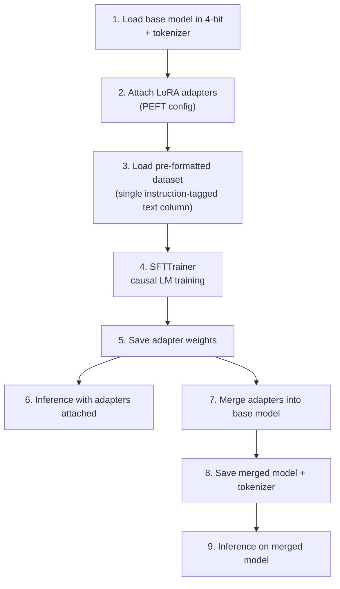
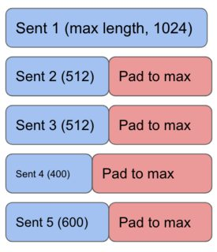
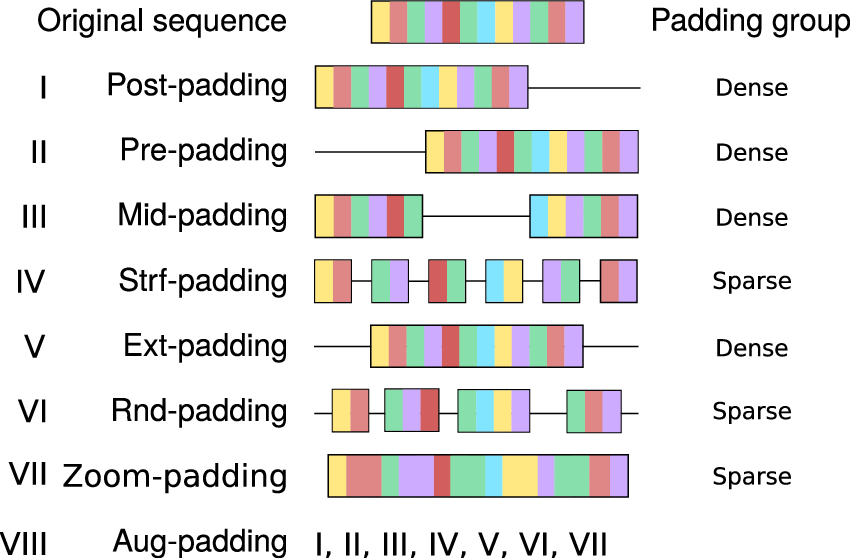
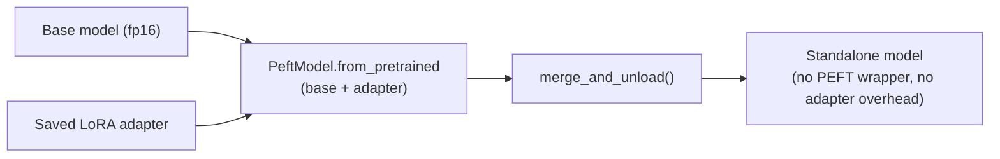

# Transfer Learning & Fine-Tuning — QLoRA on Llama-2 for Sentiment

**Base model:** [NousResearch/Llama-2-7b-chat-hf](https://huggingface.co/NousResearch/Llama-2-7b-chat-hf) —
a 7B decoder-only chat model (same architecture family as the GPT-2 used in
[module 04](../04-transformers-and-llms-p2/README.md), just much larger, hence the need for the
memory-saving techniques below).

**Dataset:** `dataset.csv` — ~21k movie reviews, pre-formatted as a single text column in Llama-2's chat
template: `<s>[INST] {review text} [/INST] {Positive|Negative} </s>`. Framing sentiment classification as
*generation* (the model literally writes the word "Positive" or "Negative" as its completion) is why a
causal LM is used here rather than a classification head — see
[module 03](../03-transformers-and-llms-p1/README.md)'s note on this pattern.

**Technique:** QLoRA (4-bit quantization + LoRA), trained via TRL's `SFTTrainer`. `fine_tuning.md` in this
folder covers the theory — PEFT, LoRA's low-rank decomposition math, QLoRA's quantization, and Supervised
Fine-Tuning — in depth, with a worked parameter-count example. This README instead walks through what
`dsa/project.py` actually does with that theory: fine-tune Llama-2-7b, then merge the adapters back into
the base model for standalone deployment.

## Pipeline Overview

---

## 1. Quantization + LoRA Configuration

Same QLoRA building blocks explained conceptually in `fine_tuning.md`, with the concrete values used here:

| LoRA setting | Value | | Quantization setting | Value |
|---|---|---|---|---|
| `r` (rank) | `32` | | `load_in_4bit` | `True` |
| `lora_alpha` | `16` | | `bnb_4bit_quant_type` | `"nf4"` |
| `lora_dropout` | `0.1` | | `bnb_4bit_compute_dtype` | `float16` |
| `bias` | `"none"` | | `bnb_4bit_use_double_quant` | `False` |
| `task_type` | `"CAUSAL_LM"` | | | |

Two details worth calling out against the general theory: `lora_alpha` (16) here is *smaller* than `r`
(32) — the opposite of the common `alpha = 2r` heuristic — meaning the adapter's contribution is scaled
down relative to its capacity, a more conservative update. And double quantization is switched off
(`use_nested_quant = False`), trading a bit of extra memory savings for simplicity, since 7B in 4-bit
already fits the target hardware without it.

## 2. Padding and Batching

The tokenizer's padding token is set to its end-of-sequence token (Llama-2, like GPT-2, ships without a
dedicated pad token) and `padding_side` is set to `"right"` — new tokens pad *after* the real content
rather than before it:

Padding every sequence in a batch out to the length of the longest one (above) is necessary for batching,
but wasteful when sequence lengths vary a lot. `group_by_length=True` mitigates this by batching
similar-length sequences together, so a batch of five 500-token reviews doesn't get padded out to
accommodate one 2000-token outlier elsewhere in the dataset:

## 3. Training Configuration — Two Configs, One Used

The notebook defines a `TrainingArguments` object first, but the `SFTTrainer` is actually constructed with
a separate `SFTConfig` — the values that matter are the ones on `SFTConfig`:

| Hyperparameter | Value | Why |
|---|---|---|
| `per_device_train_batch_size` | `2` | Small, since a 7B model in 4-bit still leaves little headroom per batch item |
| `gradient_accumulation_steps` | `4` | Simulates an effective batch size of 8 without the memory cost of holding 8 examples at once |
| `num_train_epochs` | `1` | A single pass — with ~21k examples, even one epoch is a substantial number of gradient updates |
| `learning_rate` | `2e-4` | Standard LoRA learning rate — higher than full fine-tuning tolerates, since only the small adapters are updating |
| `optim` | `"adamw_8bit"` | 8-bit optimizer state, cutting the memory AdamW's momentum/variance buffers would otherwise cost |
| `lr_scheduler_type` | `"linear"` | Learning rate decays linearly over training rather than following a cosine curve |
| `warmup_steps` | `5` | Brief ramp-up before hitting the full learning rate, avoiding an unstable start |
| `dataset_text_field` | `"train"` | Tells `SFTTrainer` which CSV column already contains the fully-formatted training text |
| `packing` | `False` | Each example is trained as its own sequence rather than concatenating multiple short examples into one fixed-length block |

Because the dataset column already contains the complete `[INST]...[/INST]` template with the label
baked in, `SFTTrainer` doesn't need a separate prompt-formatting function — training reduces to plain
causal language modeling on that pre-built string, learning to predict `Positive`/`Negative` (and the
closing tag) as the natural continuation of a review wrapped in the instruction template.

Also relevant to memory: `gradient_checkpointing` is enabled among the (unused) `TrainingArguments`
values, following the same forward-recompute-instead-of-store tradeoff described for the QLoRA setup in
[module 10](../10-customer-service-bot/README.md#2-preparing-the-frozen-model-for-training).

## 4. From Adapters to a Standalone Model

After training, the adapter weights are saved on their own (small) and used directly for a first round of
inference through a `text-generation` pipeline — this is the "keep separate" inference option
`fine_tuning.md` describes: every forward pass computes `frozen_weight(x) + adapter(x)`.

The notebook then does the second option: it reloads the *base* model fresh in fp16 (not 4-bit this time,
since there's no longer any training to save memory for), wraps it with `PeftModel.from_pretrained` using
the saved adapter, and calls `merge_and_unload()` — literally adding the LoRA delta into the base weight
matrices and discarding the separate adapter structure. The result is saved as an ordinary model +
tokenizer pair with zero LoRA-related inference overhead, deployable anywhere a plain Llama-2 checkpoint
would be, with no PEFT dependency required at serving time.

## 5. Inference

Both the adapter-attached and merged models are exercised through the same `pipeline(task="text-generation", ...)` call, prompting with the identical `<s>[INST] {review} [/INST]` template
the model was trained on — the closing `[/INST]` is where generation picks up, and the model continues
with a sentiment word rather than free-form commentary, because that's the only continuation pattern it
saw during fine-tuning.
