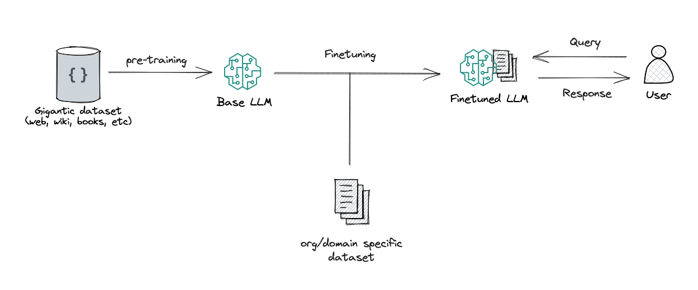
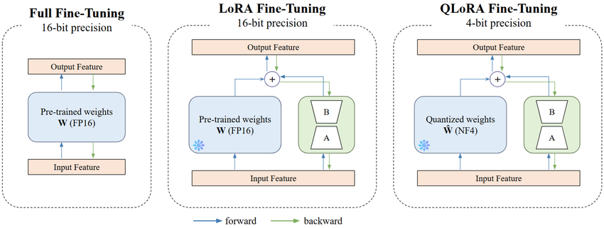

# Fine Tuning Models and Main Techniques



## Fine-Tuning with Your Own Data

It is possible to fine-tune models with any data that makes sense for a specific task.

To do this, we should pay attention to some important points beforehand:

- **Pre-trained Model Selection**: Choose a model architecture that aligns with your task domain and has demonstrated strong performance on similar problems.

- **Dataset Preparation**: Collect, clean, and format your data according to the pre-trained model's input specifications and requirements.

- **Model Adaptation**: Adjust the model architecture if needed, such as modifying output layers or adding task-specific components to match your dataset structure.

- **Training (Fine-Tuning)**: Execute the fine-tuning process with appropriate hyperparameters, monitoring performance metrics throughout.

- **Results Evaluation and Adjustments**: Assess model performance on validation data, identify bottlenecks, and iterate on hyperparameters or data preprocessing as needed.

Note that this entire process is iterative, seeking to find the best solution until it becomes feasible to deploy the entire process to a production environment.

## Performance Evaluation After Fine-Tuning

- **Test Data**: It is important to have a dataset not used during training to compare the fine-tuned model against the baseline model and understand whether improvement was achieved.

- **Appropriate Metrics**: Define relevant metrics for your specific task to ensure accuracy when measuring performance.

- **Benchmark Comparison**: Compare against established benchmarks to understand the effectiveness of fine-tuning. Did performance improve?

- **Cross-validation**: Implement cross-validation techniques to ensure robust results.

- **Failure Analysis**: Analyze cases where the model failed to gain insights into its limitations.

- **Overfitting Detection**: Check for signs of overfitting on training data.

- **Consistency and Reliability**: Test the model across different scenarios to ensure reliable performance in dynamic environments.

- **Stress Testing**: Evaluate model behavior under extreme conditions.

- **End-user Feedback**: Gather feedback from actual users to understand real-world perception and usability of the application.

## Optimization Strategies for Fine-Tuning

- **Learning Rate Adjustment**: Use a smaller learning rate during fine-tuning to prevent the model from losing valuable information learned during pre-training.

- **Learning Rate Scheduler**: Implement dynamic learning rate scheduling to adjust the rate during training based on performance.

- **Optimizer Selection**: Choose an appropriate optimizer suited to your problem, such as Adam, RMSprop, or SGD with Momentum.

- **Hyperparameter Tuning**: Adjust batch size, number of epochs, and other relevant parameters for optimal performance.

- **Gradual Unfreezing**: Progressively unfreeze layers of the pre-trained model to allow fine-tuning of deeper layers.

- **Data Augmentation**: Enhance your dataset through augmentation techniques to improve model generalization.

- **Ensemble Techniques**: Combine multiple models to improve robustness and performance.

## PEFT (Parameter-Efficient Fine-Tuning)

PEFT is a set of techniques designed to perform fine-tuning of deep neural network models while making minimal changes to the original parameters. Unlike traditional fine-tuning that updates all model weights, PEFT keeps the base model frozen and trains only a small subset of parameters, reducing computational costs significantly.

### Main PEFT Strategies:

- **Parameter Subset Adjustment**: Tune only a subset of parameters to reduce computational burden during training. Mathematically, instead of updating all parameters θ, we update only Δθ where |Δθ| ≪ |θ|.

- **Trainable Layer Addition**: Add trainable layers to the model while keeping the original base model unchanged. This allows the model to learn task-specific adaptations without modifying pre-trained weights.

- **Attention Mechanisms**: Incorporate attention mechanisms that learn task-specific patterns without altering the core model architecture.

- **Selective Layer Freezing**: Progressively freeze or unfreeze specific layers of the base model to control which parameters participate in gradient updates during training.

- **Matrix Decomposition**: Reduce the number of trainable parameters through matrix factorization. For example, Low-Rank Adaptation (LoRA) replaces weight updates ΔW with a product of two low-rank matrices: ΔW = A·B, where A ∈ ℝ^(m×r) and B ∈ ℝ^(r×n) with r ≪ min(m,n). This can reduce parameters by 99%+ while maintaining performance.

### Key Advantages:

- **Memory Efficiency**: Reduces GPU memory requirements from gigabytes to kilobytes for fine-tuning parameters.

- **Speed**: Faster training due to fewer parameters to update.

- **Practical Deployment**: Enables fine-tuning of large language models on consumer hardware.

- **Multiple Task Adaptation**: Train separate small adapters for different tasks without duplicating the entire model. 

## LoRA (Low-Rank Adaptation)

LoRA is one of the most popular PEFT techniques that achieves parameter efficiency through low-rank matrix decomposition. Instead of updating the full weight matrix during fine-tuning, LoRA keeps the pre-trained weights frozen and injects trainable low-rank decomposition matrices.

### Mathematical Formulation

**Traditional Fine-Tuning:**
In standard fine-tuning, a weight matrix $W \in \mathbb{R}^{d \times k}$ is updated during training:

$$W_{new} = W_0 + \Delta W$$

where $\Delta W \in \mathbb{R}^{d \times k}$ requires training $d \times k$ parameters.

**LoRA Approach:**
LoRA decomposes the update $\Delta W$ into two low-rank matrices:

$$\Delta W = BA$$

where:
- $B \in \mathbb{R}^{d \times r}$ (down-projection matrix)
- $A \in \mathbb{R}^{r \times k}$ (up-projection matrix)
- $r \ll \min(d, k)$ (rank, typically $r \in [1, 64]$)

The forward pass becomes:

$$h = W_0 x + \Delta W x = W_0 x + BAx$$

**Parameter Reduction:**
- Original parameters: $d \times k$
- LoRA parameters: $r \times (d + k)$
- Reduction ratio: $\frac{r(d + k)}{d \times k}$

### Practical Example

**Scenario:** Fine-tuning GPT-2 (124M parameters) for sentiment analysis

**Configuration:**
- Target layer: Query projection matrix in attention: $W_q \in \mathbb{R}^{768 \times 768}$
- Rank: $r = 8$

**Parameter Calculation:**

Traditional fine-tuning:
```
Parameters to train = 768 × 768 = 589,824
```

LoRA:
```
Matrix A: 8 × 768 = 6,144 parameters
Matrix B: 768 × 8 = 6,144 parameters
Total: 12,288 parameters (97.9% reduction!)
```

**Implementation Flow:**

1. **Initialization:**
   - Matrix $A$ initialized with random Gaussian: $A \sim \mathcal{N}(0, \sigma^2)$
   - Matrix $B$ initialized to zeros: $B = 0$ (ensures $\Delta W = 0$ at start)
   - Original weights $W_0$ remain frozen

2. **Forward Pass:**
   ```python
   # Traditional: h = W @ x
   # LoRA: h = W_0 @ x + (B @ A) @ x
   
   output = pretrained_weight @ input + (lora_B @ lora_A) @ input
   ```

3. **Training:**
   - Only $A$ and $B$ receive gradients
   - $W_0$ stays unchanged
   - Scaling factor $\alpha/r$ often applied: $h = W_0 x + \frac{\alpha}{r}BAx$

4. **Inference Options:**
   - **Option 1 (Efficient):** Keep separate and compute $W_0 x + BAx$
   - **Option 2 (Merged):** Merge weights $W_{merged} = W_0 + BA$ for zero overhead

**Performance Impact:**

| Metric | Traditional | LoRA (r=8) |
|--------|------------|------------|
| Trainable Parameters | 124M | ~262K |
| GPU Memory | ~500MB | ~50MB |
| Training Speed | 1x | ~3x faster |
| Accuracy on Task | 92.3% | 92.1% |

### Key Advantages

- **Memory Efficiency:** 10-100x reduction in trainable parameters
- **Storage Efficiency:** Multiple task-specific LoRA adapters can be stored separately (~10MB each vs 500MB full model)
- **Switching Tasks:** Swap adapters instantly without reloading the base model
- **No Inference Latency:** When merged, adds zero computational overhead
- **Prevents Catastrophic Forgetting:** Base model knowledge preserved

### Hyperparameter Selection

- **Rank ($r$):** 
  - Smaller $r$ (4-8): More efficient, risk underfitting
  - Larger $r$ (16-64): Better performance, higher cost
  - Typical range: 8-32 for most applications

- **Alpha ($\alpha$):**
  - Scaling factor for LoRA updates
  - Common practice: $\alpha = 2r$ or $\alpha = r$
  
- **Target Modules:**
  - Query/Value projections in attention: Most common
  - All linear layers: Maximum flexibility
  - Task-specific: Depends on fine-tuning objective

## QLoRA (Quantized Low-Rank Adaptation)

QLoRA combines LoRA's parameter efficiency with quantization to achieve even greater memory savings, enabling fine-tuning of large models (65B+ parameters) on consumer GPUs.

### Core Concept

QLoRA applies two complementary techniques:

1. **Low-Rank Decomposition:** Uses LoRA matrices $A$ and $B$ to minimize trainable parameters
2. **Quantization:** Reduces precision of frozen base model weights from FP32 to lower bit representations

### Quantization Fundamentals

**Precision Reduction:**
Convert high-precision weights to lower precision formats:

- **FP32 (32-bit):** Standard precision, ~4 bytes per parameter
- **FP16 (16-bit):** Half precision, ~2 bytes per parameter  
- **INT8 (8-bit):** Integer quantization, ~1 byte per parameter
- **NF4 (4-bit):** QLoRA's 4-bit NormalFloat format, ~0.5 bytes per parameter

**Memory Calculation Example:**
For a 7B parameter model:
```
FP32: 7B × 4 bytes = 28 GB
FP16: 7B × 2 bytes = 14 GB
INT8: 7B × 1 byte  = 7 GB
NF4:  7B × 0.5 bytes = 3.5 GB
```

### QLoRA Architecture

**Key Innovation - 4-bit NormalFloat (NF4):**
QLoRA uses NF4 quantization optimized for normally distributed neural network weights, providing better accuracy than standard 4-bit integers.

**Double Quantization:**
Quantizes the quantization constants themselves to save additional memory.

**Mathematical Flow:**

$$h = \text{Dequantize}(W_0^{4bit}) \cdot x + BA \cdot x$$

where:
- $W_0^{4bit}$: Base model weights in 4-bit NF4 format (frozen)
- $B, A$: LoRA adapters in FP16/BF16 (trainable)
- Dequantization happens on-the-fly during forward pass

### Practical Example

**Scenario:** Fine-tuning LLaMA-2 7B on a single GPU

| Configuration | Memory Required | Trainable Params |
|---------------|----------------|------------------|
| Full Fine-Tuning (FP32) | ~28 GB | 7B |
| LoRA (FP16) | ~14 GB | ~8M |
| QLoRA (NF4 + LoRA) | ~5 GB | ~8M |

**Result:** QLoRA enables 7B model fine-tuning on consumer GPUs (RTX 3090/4090 with 24GB VRAM) while maintaining 99%+ of full fine-tuning quality.

### Key Advantages

- **Extreme Memory Efficiency:** 4-8x reduction compared to standard LoRA
- **Accessibility:** Fine-tune 65B models on single consumer GPU
- **Minimal Quality Loss:** <1% performance degradation vs FP16 LoRA
- **Backward Compatible:** Works with existing LoRA infrastructure

### Trade-offs

- **Slower Training:** Dequantization adds ~30-40% overhead per iteration
- **Inference Overhead:** Requires dequantization unless weights are merged
- **Hardware Requirements:** Benefits most from modern GPUs with fast memory bandwidth

