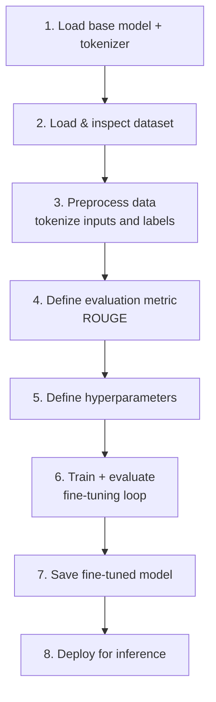
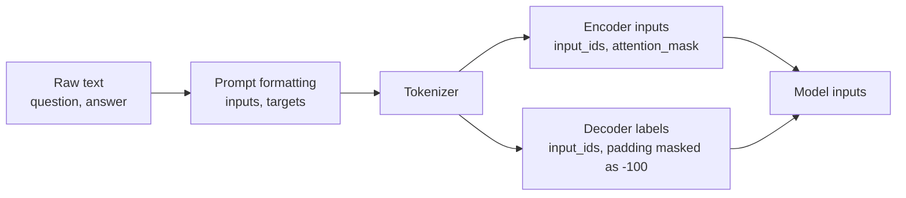
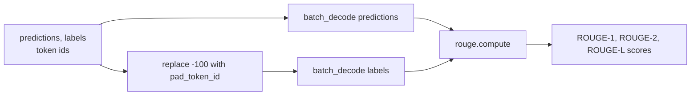
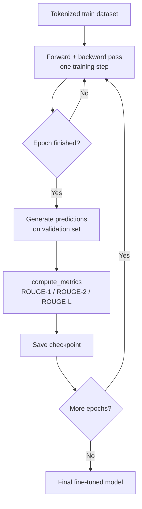
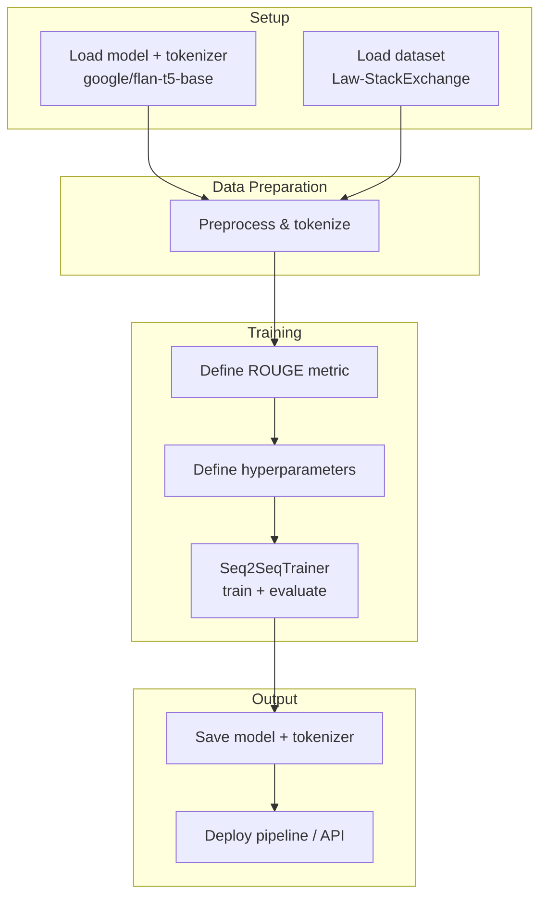

# Legal Assistant — Fine-Tuning FLAN-T5 for Legal Q&A

**Dataset:** [ymoslem/Law-StackExchange](https://huggingface.co/datasets/ymoslem/Law-StackExchange) — legal questions and answers scraped from the Law Stack Exchange forum.

**Base model:** [google/flan-t5-base](https://huggingface.co/google/flan-t5-base) — an encoder-decoder (seq2seq) model, instruction-tuned on top of T5, well suited for text-to-text tasks like question answering.

**Task framing:** given a legal question as input text, generate a legal answer as output text (sequence-to-sequence, not classification).

## Pipeline Overview

Fine-tuning a seq2seq model follows a fixed order — each step depends on artifacts produced by the previous one:



---

## 1. Model and Tokenizer

The tokenizer is not interchangeable with any other — it encodes the exact vocabulary and rules (special tokens, subword splitting) the base model was pretrained with. Loading a mismatched tokenizer silently corrupts the inputs, so it must always come from the **same checkpoint** as the model.

```
model_name = "google/flan-t5-base"

tokenizer = AutoTokenizer.from_pretrained(model_name)
model     = AutoModelForSeq2SeqLM.from_pretrained(model_name)
```

## 2. Preprocessing

The raw dataset (question/answer text pairs) must be converted into token ids the model can consume. The flow is:



Pseudocode:

```
function preprocess(batch):
    inputs  = ["answer the legal question: " + q for q in batch.question]
    targets = batch.answer

    model_inputs = tokenizer(inputs, max_length=MAX_INPUT_LEN, truncation=True)
    labels       = tokenizer(targets, max_length=MAX_TARGET_LEN, truncation=True)

    # padding token ids in labels must be masked so the loss ignores them
    labels.input_ids = replace(labels.input_ids, pad_token_id, -100)

    model_inputs.labels = labels.input_ids
    return model_inputs

tokenized_dataset = dataset.map(preprocess, batched=True)
```

## 3. Evaluation Metric — ROUGE

**ROUGE** (Recall-Oriented Understudy for Gisting Evaluation) measures how much overlap a generated text has with one or more reference texts. It was designed for summarization but is the standard metric for any generative task with a "ground-truth" text to compare against — including QA and legal-answer generation.

Given a **candidate** (model-generated) and a **reference** (ground truth), ROUGE reports:

- **Recall** = overlapping units / units in reference — "how much of the reference did we capture?"
- **Precision** = overlapping units / units in candidate — "how much of what we generated is actually relevant?"
- **F1** = harmonic mean of precision and recall

The variants differ only in what counts as a "unit":

| Variant | Unit compared | Captures |
|---|---|---|
| **ROUGE-N** | n-grams (N=1 unigrams, N=2 bigrams, ...) | word/phrase overlap |
| **ROUGE-L** | Longest Common Subsequence (LCS) | in-order overlap, tolerant to gaps/insertions |
| **ROUGE-W** | weighted LCS | like ROUGE-L, but rewards *consecutive* matches over scattered ones |
| **ROUGE-S** | skip-bigrams (any ordered pair, gaps allowed) | looser word-order sensitivity than ROUGE-N |

In practice, HuggingFace's `evaluate` library reports **ROUGE-1, ROUGE-2, ROUGE-L (and ROUGE-Lsum)** by default; ROUGE-W and ROUGE-S are rarely used outside the original ROUGE paper/toolkit.

### Worked example

```
reference: "the cat sat on the mat"
candidate: "the cat was sat on the mat"
```

**ROUGE-1** (unigram overlap): reference has 6 tokens, candidate has 7. Matched tokens: `the`(×2), `cat`, `sat`, `on`, `mat` → 6 overlapping unigrams.

```
recall    = 6 / 6 = 1.000
precision = 6 / 7 = 0.857
F1        = 2 * (0.857 * 1.000) / (0.857 + 1.000) = 0.923
```

**ROUGE-2** (bigram overlap): reference bigrams = `{the-cat, cat-sat, sat-on, on-the, the-mat}` (5); candidate bigrams = `{the-cat, cat-was, was-sat, sat-on, on-the, the-mat}` (6). Matched: `the-cat, sat-on, on-the, the-mat` → 4.

```
recall    = 4 / 5 = 0.800
precision = 4 / 6 = 0.667
F1        = 2 * (0.667 * 0.800) / (0.667 + 0.800) = 0.727
```

**ROUGE-L** (LCS): the longest common subsequence between the two sentences is `the cat sat on the mat` (length 6) — the extra word `was` in the candidate simply doesn't participate.

```
recall    = 6 / 6 = 1.000
precision = 6 / 7 = 0.857
F1        = 0.923   (same as ROUGE-1 in this example)
```

**Interpretation:** ROUGE-1 shows almost all reference content was reproduced; ROUGE-2 drops because inserting "was" breaks two bigrams; ROUGE-L confirms the sentence still preserves the reference's word order despite the insertion. Comparing several variants side-by-side is how you distinguish "captured the right words" (ROUGE-1) from "captured the right phrasing/order" (ROUGE-L).

### `compute_metrics` used by the Trainer



```
function compute_metrics(eval_predictions):
    predictions, labels = eval_predictions

    decoded_preds  = tokenizer.batch_decode(predictions, skip_special_tokens=True)
    labels         = replace(labels, -100, tokenizer.pad_token_id)
    decoded_labels = tokenizer.batch_decode(labels, skip_special_tokens=True)

    scores = rouge.compute(predictions=decoded_preds, references=decoded_labels)
    return scores   # {rouge1, rouge2, rougeL, rougeLsum}
```

## 4. Hyperparameters

Defined before training via `Seq2SeqTrainingArguments` (or equivalent):

- **learning_rate** — usually small (e.g. `2e-5` to `5e-4`) since we are adapting, not training from scratch
- **per_device_train/eval_batch_size** — limited by available GPU memory
- **num_train_epochs** — how many passes over the training set
- **weight_decay** — regularization to reduce overfitting
- **predict_with_generate=True** — required so evaluation actually autoregressively generates text (needed for ROUGE), instead of just computing loss
- **eval_strategy / save_strategy** — when to run evaluation and checkpointing (e.g. every epoch)

## 5. Training + Evaluation



```
training_args = Seq2SeqTrainingArguments(
    learning_rate=...,
    per_device_train_batch_size=...,
    per_device_eval_batch_size=...,
    num_train_epochs=...,
    weight_decay=...,
    predict_with_generate=True,
    eval_strategy="epoch",
    save_strategy="epoch",
)

trainer = Seq2SeqTrainer(
    model=model,
    args=training_args,
    train_dataset=tokenized_dataset.train,
    eval_dataset=tokenized_dataset.validation,
    tokenizer=tokenizer,
    data_collator=data_collator,       # dynamic padding per batch
    compute_metrics=compute_metrics,
)

trainer.train()
metrics = trainer.evaluate()          # ROUGE scores on the validation set
```

## 6. Save the Model

```
model.save_pretrained(output_dir)
tokenizer.save_pretrained(output_dir)
```

Saving both together guarantees that whoever loads the model later gets the exact tokenizer it was fine-tuned with.

## 7. Deployment

```
legal_assistant = pipeline("text2text-generation", model=output_dir, tokenizer=output_dir)

answer = legal_assistant("answer the legal question: " + user_question)
```

The model can also be pushed to the Hugging Face Hub (`push_to_hub`) for reuse or served behind an API for the legal-assistant application.

---

## End-to-End Summary



Pseudocode:

```
tokenizer, model = load_pretrained("google/flan-t5-base")

dataset = load_dataset("ymoslem/Law-StackExchange")
tokenized_dataset = dataset.map(preprocess, batched=True)

rouge = load_metric("rouge")

training_args = Seq2SeqTrainingArguments(...)
trainer = Seq2SeqTrainer(model, training_args, tokenized_dataset,
                          compute_metrics=compute_metrics_with(rouge))

trainer.train()
trainer.evaluate()

save(model, tokenizer, output_dir)
deploy(output_dir)
```
