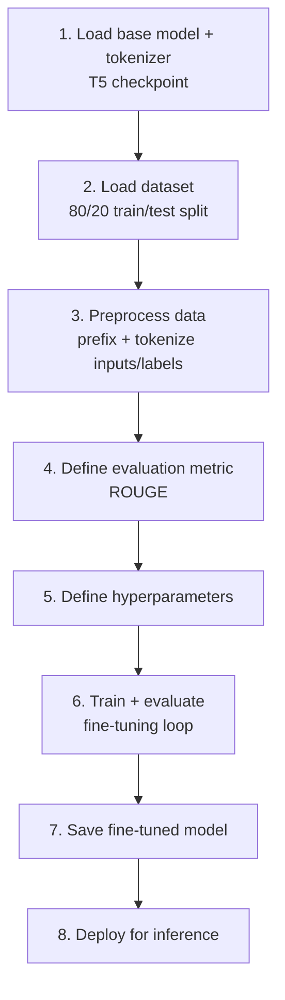
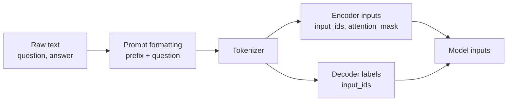
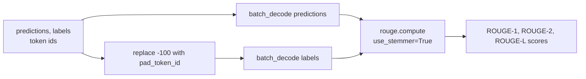
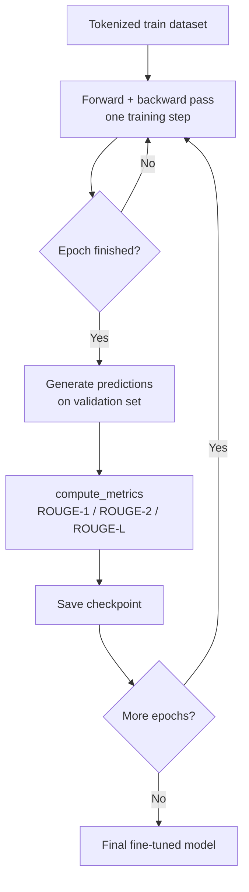
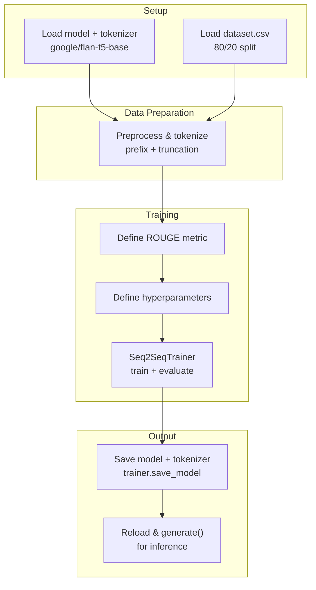

# Legal Assistant — Fine-Tuning FLAN-T5 for Legal Q&A

**Reference:** [Exploring Transfer Learning with T5: the Text To Text Transfer Transformer](https://blog.research.google/2020/02/exploring-transfer-learning-with-t5.html)

**Dataset:** `dataset.csv` (~3,868 `question`/`answer` pairs derived from
[ymoslem/Law-StackExchange](https://huggingface.co/datasets/ymoslem/Law-StackExchange)) — legal questions
and answers scraped from the Law Stack Exchange forum, loaded locally and split 80/20 into train/test.

**Base model:** [google/flan-t5-base](https://huggingface.co/google/flan-t5-base) — an encoder-decoder
(seq2seq) model, instruction-tuned on top of T5, well suited for text-to-text tasks like question
answering.

**Task framing:** given a legal question as input text, generate a legal answer as output text (sequence-
to-sequence, not classification).

## Pipeline Overview

Fine-tuning a seq2seq model follows a fixed order — each step depends on artifacts produced by the
previous one:

---

## 1. Model and Tokenizer

The tokenizer is not interchangeable with any other — it encodes the exact vocabulary and rules (special
tokens, subword splitting) the base model was pretrained with. Loading a mismatched tokenizer silently
corrupts the inputs, so it must always come from the **same checkpoint** as the model
(`google/flan-t5-base` for both). The tokenizer is loaded with `legacy=False`, opting into the newer,
non-legacy SentencePiece conversion behavior recommended for T5-family models.

A `DataCollatorForSeq2Seq`, built from that tokenizer and model, sits between the tokenized dataset and
the trainer: at batch-build time it dynamically pads each batch to its longest sequence (rather than a
fixed global length) and automatically replaces the padding token ids inside the **labels** with `-100`,
the value PyTorch's cross-entropy loss is configured to ignore. This is what keeps padding from being
treated as a real token the model must learn to predict — it happens per-batch in the collator, not as a
manual step during preprocessing.

## 2. Preprocessing

The raw dataset (question/answer text pairs) must be converted into token ids the model can consume:

Every question is prefixed with `"answer the question: "` before tokenization — a T5/FLAN-T5 convention
where the prefix frames the task in natural language, since these models were pretrained to condition
their output on such instruction-like prefixes. Inputs (questions) are truncated at 128 tokens and targets
(answers) at 512 tokens: legal answers tend to be much longer than the questions that prompt them, so the
two sequences are given asymmetric length budgets.

## 3. Evaluation Metric — ROUGE

This project uses **ROUGE** to score generated answers against reference answers. What ROUGE measures, its
variants (ROUGE-N/L/W/S), and a worked numeric example live in
[`metrics_to_evaluate_llms.md`](../03-transformers-and-llms-p1/metrics_to_evaluate_llms.md#rouge-recall-oriented-understudy-for-gisting-evaluation)
— this section covers only how the metric is actually computed inside the training loop.

### Computing the metric during training

Since the collator injected `-100` into the labels for loss masking, that substitution has to be undone
(`-100` → `pad_token_id`) before the label ids can be decoded back into text — `-100` is not a valid token
id. `use_stemmer=True` reduces words to their stem before comparing (e.g. "filing"/"filed" both count as
"file"), which keeps ROUGE from over-penalizing legitimate morphological variation in legal phrasing. NLTK's
`punkt`/`punkt_tab` sentence tokenizers are downloaded as part of this step, since ROUGE-style preprocessing
conventionally operates sentence-by-sentence.

## 4. Hyperparameters

Defined via `Seq2SeqTrainingArguments`:

| Hyperparameter | Value | Why |
|---|---|---|
| `learning_rate` | `3e-4` | Small, since we're adapting a pretrained model, not training from scratch |
| `per_device_train_batch_size` | `4` | Limited by available GPU memory for a base-size T5 |
| `per_device_eval_batch_size` | `2` | Generation during eval is more memory-hungry than a forward pass |
| `num_train_epochs` | `3` | Few epochs — enough to adapt without overfitting a fine-tuning-sized dataset |
| `weight_decay` | `0.01` | Light regularization |
| `predict_with_generate` | `True` | Required so evaluation actually autoregressively generates text (needed for ROUGE), instead of just computing loss |
| `eval_strategy` | `"epoch"` | Evaluate once per epoch |
| `save_total_limit` | `3` | Caps how many checkpoints are kept on disk |
| `push_to_hub` | `False` | Model is saved locally only |

## 5. Training + Evaluation

`Seq2SeqTrainer` orchestrates this loop end to end: it consumes the tokenized train/test splits, the data
collator (dynamic padding + label masking), and the `compute_metrics` function defined above, then runs
the epochs specified in the training arguments.

## 6. Saving the Model

Because the tokenizer was registered with the `Seq2SeqTrainer` at construction time, a single
`trainer.save_model(...)` call persists both the fine-tuned model weights and the tokenizer together to
disk — this guarantees whoever loads the model later gets the exact tokenizer it was fine-tuned with,
without a separate save step.

## 7. Deployment

Inference reloads the saved model/tokenizer from disk and calls `.generate()` directly (no `pipeline`
wrapper): the input question is tokenized, generation is capped at 50 tokens, and `do_sample=True` with
`temperature=0.4` is used — sampling with a fairly low temperature, trading strict determinism for some
lexical variety in the answer while still staying close to the model's most likely continuations. The
output ids are then decoded back to text, skipping special tokens.

---

## End-to-End Summary

