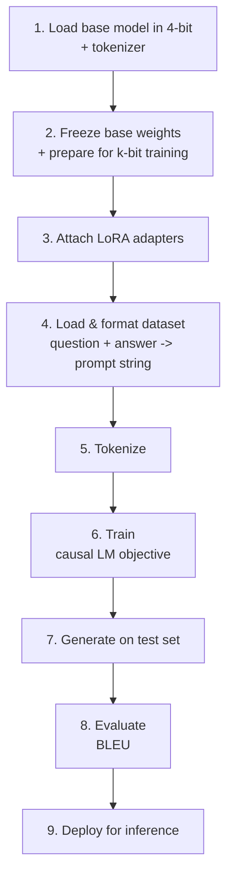
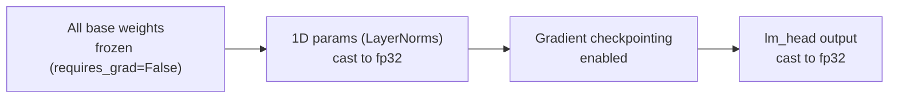
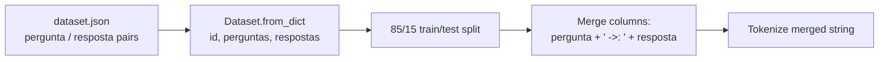
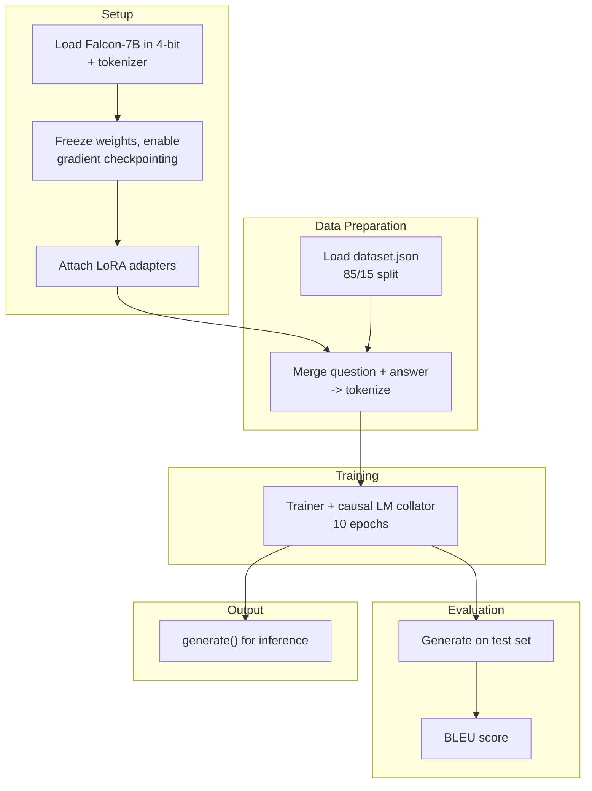

# Customer Service Bot — QLoRA Fine-Tuning Falcon-7B for Support Chat

**Base model:** [tiiuae/falcon-7b](https://huggingface.co/tiiuae/falcon-7b) — a 7B-parameter causal
(decoder-only) language model. Unlike the seq2seq FLAN-T5 setup in the
[legal assistant module](../09-legal-assistant-llm-finetuning/README.md), this is plain next-token
prediction: there's no separate encoder/decoder, just a prompt the model learns to continue.

**Dataset:** `dataset.json` — a small, hand-written set of 6 Portuguese customer-support Q&A pairs
(e.g. "Como posso criar uma conta?"). This is intentionally a toy dataset: the point of the module is the
QLoRA fine-tuning *mechanism*, not a production-quality bot — later sections note where that shows up in
the results.

**Technique:** [QLoRA](https://huggingface.co/blog/4bit-transformers-bitsandbytes) — the base model is
loaded quantized to 4-bit precision and kept fully frozen; only small
[LoRA](https://huggingface.co/docs/peft) adapter matrices are trained on top. This is what makes fine-
tuning a 7B model tractable on a single consumer/prosumer GPU, at the cost of some extra setup compared to
plain full fine-tuning.

## Pipeline Overview

---

## 1. 4-bit Quantization

The base model is loaded through a `BitsAndBytesConfig` rather than in full precision:

| Setting | Value | Purpose |
|---|---|---|
| `load_in_4bit` | `True` | Store weights at 4-bit precision instead of 16/32-bit, cutting memory footprint roughly 4-8x |
| `bnb_4bit_quant_type` | `"nf4"` | NormalFloat4 — a quantization scheme tuned for the roughly-normal distribution of pretrained weights, more accurate than plain 4-bit at the same bit width |
| `bnb_4bit_use_double_quant` | `True` | Quantizes the quantization constants themselves, squeezing out a bit more memory with negligible accuracy cost |
| `bnb_4bit_compute_dtype` | `torch.float16` | Matmuls are de-quantized and computed in fp16, not 4-bit — 4-bit is a *storage* format, not a compute one |
| `llm_int8_enable_fp32_cpu_offload` | `True` | Lets layers that don't fit on the GPU spill to CPU in fp32 rather than failing to load |

This is what makes it possible to fit a 7B model's frozen weights on hardware that couldn't hold it at
full precision — the tradeoff is a small amount of accuracy lost to quantization, which QLoRA's authors
found to be recoverable by fine-tuning the (unquantized) LoRA adapters on top.

## 2. Preparing the Frozen Model for Training

Four adjustments happen before any adapter is attached, all standard practice for QLoRA-style training:

- **Every original parameter is frozen.** Only the LoRA adapters added in the next step will receive
  gradients — the 7B base weights never move.
- **1-D parameters (LayerNorm weights/biases) are cast to fp32**, even though the rest of the model stays
  quantized. Normalization layers are numerically sensitive; keeping them at full precision avoids
  instability that low-precision norms are prone to.
- **Gradient checkpointing** is enabled (`gradient_checkpointing_enable` + `enable_input_require_grads`).
  Instead of keeping every intermediate activation in memory for the backward pass, only a subset of
  checkpoints is kept and the rest are recomputed on the fly — trading extra compute for a large reduction
  in memory, which matters when most of the GPU's memory is already spent holding a 7B model.
- **The LM head's output is wrapped to force fp32.** The classifier/output layer is the most precision-
  sensitive part of the forward pass for loss computation, so its output is cast up even though the layers
  feeding into it may run in reduced precision.

## 3. LoRA Adapters

Rather than updating the full weight matrices of a 7B model, LoRA inserts small trainable low-rank
matrices alongside the (frozen) original weights in the attention layers. The forward pass becomes
`frozen_weight(x) + adapter(x)`, and only `adapter` accumulates gradients — reducing the trainable
parameter count by orders of magnitude while still letting the model adapt to a new task/domain.

| `LoraConfig` setting | Value | Purpose |
|---|---|---|
| `r` | `16` | Rank of the adapter matrices — the effective "bottleneck" size of the update; higher = more capacity, more trainable params |
| `lora_alpha` | `32` | Scaling factor applied to the adapter's output, controlling how much it can shift the frozen model's behavior |
| `lora_dropout` | `0.05` | Regularization on the adapter path only |
| `bias` | `"none"` | No bias terms are added by the adapters |
| `task_type` | `"CAUSAL_LM"` | Tells PEFT which attention modules to target for a decoder-only causal LM |

After wrapping the model with `get_peft_model`, printing the trainable-vs-total parameter ratio confirms
that only a small fraction of the 7B parameters (the adapters) are actually being trained — the practical
signal that QLoRA is working as intended.

## 4. Data Preparation

Each question/answer pair is merged into a single string with a `" ->: "` separator between question and
answer — a completion-style prompt format (question, then an explicit marker, then the answer) rather than
a structured instruction template. The *entire* merged string is tokenized and used as-is; there's no
separate masking of the question portion, so the causal LM objective computes loss over the whole
sequence (question tokens included), not just the answer. With only 6 examples total, an 85/15 split
leaves a single held-out example for test — enough to sanity-check generation, not to draw statistically
meaningful conclusions.

## 5. Training

`transformers.Trainer` is used directly (not `Seq2SeqTrainer`, since there's no separate generation step
during training) with `DataCollatorForLanguageModeling(tokenizer, mlm=False)` — `mlm=False` selects causal
(next-token) language modeling instead of masked language modeling, matching Falcon's decoder-only
architecture.

| Hyperparameter | Value | Why |
|---|---|---|
| `learning_rate` | `2e-4` | Higher than a typical full fine-tune, but standard for LoRA — only a small adapter is being trained |
| `per_device_train_batch_size` | `2` | Small batch, constrained by GPU memory even with 4-bit weights |
| `gradient_accumulation_steps` | `2` | Simulates a larger effective batch size by accumulating gradients over multiple steps before an optimizer update |
| `num_train_epochs` | `10` | More epochs than the legal-assistant module, reasonable given the dataset has only a handful of examples |
| `fp16` | `True` | Mixed-precision training for speed/memory, consistent with the fp16 compute dtype chosen for quantization |
| `eval_strategy` | `"epoch"` | Evaluate once per epoch |

Before training, `model.config.use_cache = False` disables the key/value cache — it's incompatible with
gradient checkpointing, since checkpointing assumes activations get recomputed rather than reused.

## 6. Evaluation — BLEU

This project uses **BLEU** to score generated answers against reference answers. What BLEU measures
(n-gram precision, geometric mean, brevity penalty) and how it compares to ROUGE lives in
[`metrics_to_evaluate_llms.md`](../03-transformers-and-llms-p1/metrics_to_evaluate_llms.md#bleu-bilingual-evaluation-understudy)
— this section covers only the actual results from this run.

In this run, unigram precision (~0.375) was noticeably higher than 4-gram precision (~0.133), while the
brevity penalty stayed close to 1 (generated and reference lengths were similar). That pattern — decent
individual-word overlap but a sharp drop-off for longer n-grams — points to weak phrase-level fluency
rather than a length problem, which tracks with fine-tuning on only 6 examples: enough for the model to
pick up isolated vocabulary, not enough to learn stable multi-word phrasing.

## 7. Deployment

Inference re-applies the same prompt format used in training: the user's question is tokenized with the
`" ->: "` suffix appended (mirroring how the model was trained to expect the answer to start), moved to
the model's device, and generated with `max_new_tokens=50`. Since Falcon's tokenizer has no dedicated pad
token, `eos_token_id` is reused as the pad token — a common workaround for decoder-only models. Generation
runs inside `torch.no_grad()` and `torch.cuda.amp.autocast()`, avoiding gradient tracking and letting
PyTorch pick fp16 vs fp32 per-operator automatically for faster, lower-memory inference. The output ids
are decoded back to text with special tokens stripped.

---

## End-to-End Summary

