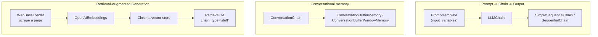

# LangChain Part 1 — Chains, Memory & Retrieval-Augmented Generation

**LLM:** OpenAI, via two interfaces — `OpenAI` (completion-style, used for standalone prompt-in/text-out
calls) and `ChatOpenAI` (chat-style, used for the conversational chatbot at the end). Concepts (prompt
templates, chain types, memory types, retrieval chains) are covered in
[`langchain.md`](./langchain.md); this README covers how they're actually configured and combined.

> **Note:** `LLMChain`, `SimpleSequentialChain`/`SequentialChain`, `ConversationBufferMemory`/
> `ConversationBufferWindowMemory`/`ConversationChain`, `RetrievalQA`, and `VectorstoreIndexCreator` are all
> pre-1.0 "classic" LangChain APIs — see the notes in [`langchain.md`](./langchain.md#chains) for what
> replaced each of them. Documented here as-is because it reflects what was actually built.

## Pipeline Overview

## 1. LLM Configuration

Every LLM instance is created with an explicit `temperature`, the hyperparameter controlling how
deterministic vs. creative generations are — lower values push the model toward its most likely
continuation, higher values sample more broadly. Different sections of this module reach for different
values depending on how much variety is wanted: `0.9` for open-ended brainstorming (naming a restaurant),
`0.6`–`0.7` for structured multi-step generation, and `0` for the chatbot, where consistent, predictable
answers matter more than creative variation.

## 2. Prompt Templates

A `PromptTemplate` is built with an explicit `input_variables` list and a `template` string containing
matching `{placeholder}` markers — e.g. a single `culinaria` (cuisine) variable filled in at call time to
produce "Quero abrir um restaurante de comida italiana...". Calling `.format(...)` on the template renders
the final string; passing the template (not a pre-rendered string) into a chain is what lets the chain
re-render it with new variable values on every call.

## 3. Chains

| Chain | Structure used | Notes |
|---|---|---|
| `LLMChain` | One `PromptTemplate` + one LLM | `verbose=True` prints the fully rendered prompt before sending it — useful for confirming template substitution worked as expected |
| `SimpleSequentialChain` | Two `LLMChain`s: cuisine → restaurant name → menu items | Each chain's single text output becomes the next chain's single text input; no named variables |
| `SequentialChain` | Same two-step pipeline, rebuilt with named keys | Each `LLMChain` declares an explicit `output_key` (`nome_restaurante`, `itens_menu`); the outer chain declares `input_variables` and `output_variables`, so the final result is a dict exposing every intermediate value, not just the last one |

The `SequentialChain` version trades a little setup verbosity for the ability to inspect (or reuse) an
intermediate step's output directly, rather than only ever seeing the final chain's result.

## 4. Memory

Two memory types are attached to a plain `LLMChain` first, then to a purpose-built `ConversationChain`:

- **`ConversationBufferMemory`** — attached to an `LLMChain`, it accumulates every prior call's
  input/output into `.buffer`, which gets prepended to the prompt on the next call.
- **`ConversationBufferWindowMemory(k=1)`** — attached to a `ConversationChain`, it keeps only the single
  most recent exchange; asking a follow-up question that depends on context from two turns back will fail,
  since it's already fallen outside the window.
- **`ConversationChain`** — used with its default built-in prompt template for a general-purpose Q&A
  conversation, and later rebuilt with a **custom** `PromptTemplate` (`history` + `input` variables) and a
  custom `ai_prefix` to specialize the persona (see §5).

## 5. Retrieval-Augmented Generation

Two ways of building the same retrieval pipeline appear back to back:

- **`VectorstoreIndexCreator`** — a convenience wrapper that takes a document loader directly and handles
  embedding + indexing internally; querying it with `index.query(question, llm=...)` returns an answer in
  one call, with no manual control over the intermediate steps.
- **Manual assembly** — `WebBaseLoader` scrapes a single web page into a document, `OpenAIEmbeddings`
  embeds it, `Chroma.from_documents(...)` builds the [Chroma](./chroma.md) vector store explicitly, and a `RetrievalQA` chain
  (`chain_type="stuff"`, `retriever=db.as_retriever(search_kwargs={"k": 1})`) ties retrieval and generation
  together — `k=1` means only the single nearest document chunk is retrieved per query. A custom
  `PromptTemplate` with `context` and `question` variables controls exactly how the retrieved text is
  framed for the model, which the `VectorstoreIndexCreator` shortcut doesn't expose.

The manual path is more verbose but makes every stage — embedding model, store, retriever `k`, prompt
wording — independently swappable, the same tradeoff the "stuff" chain type makes generally (see
[`langchain.md`](./langchain.md#retrieval-augmented-generation)).

## 6. Putting It Together — A Specialized Chatbot

The final piece combines a custom prompt, a persona, and memory into one conversational agent: a
`ChatOpenAI` instance (`temperature=0`, favoring consistent answers) is paired with a `PromptTemplate`
whose text fixes the assistant's persona ("a sports-car sales specialist") and whose `{history}`/`{input}`
placeholders are filled automatically by an attached `ConversationBufferMemory`. Setting `ai_prefix` on the
memory (instead of the default `"AI"`) changes the label the persona's turns are recorded under in the
buffer, keeping the transcript readable. The chatbot runs in a simple loop, taking user input and printing
the model's response each turn until a fixed interaction count is reached.
