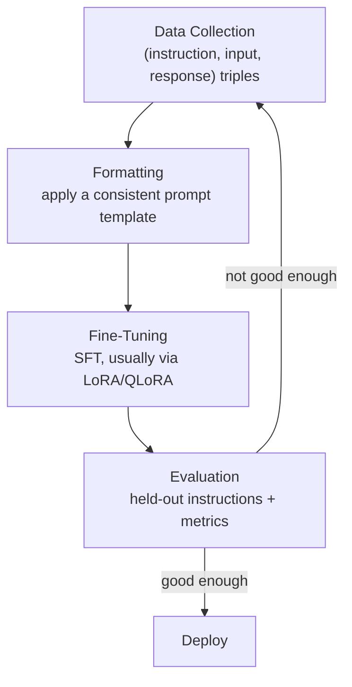

# Instruction Fine-Tuning

Instruction fine-tuning is a form of [Supervised Fine-Tuning](../06-07-08-transfer-learning-fine-tuning/fine_tuning.md#supervised-fine-tuning-sft)
where the training data is specifically structured as **(instruction, response)** pairs — the model
learns to follow a natural-language instruction and produce the response a human would consider correct,
rather than just continuing text plausibly. A base LLM, pretrained with self-supervised next-token
prediction on raw text, is good at completing text but has no notion of "answer what was asked" —
instruction fine-tuning is what turns that raw completer into something that behaves like an assistant.

## Why Use It

- **Instruction following** — a base model prompted with "Summarize this paragraph" may just continue the
  paragraph instead of summarizing it; instruction fine-tuning directly teaches the model to recognize and
  act on the instruction itself.
- **Alignment with intent** — closes the gap between "statistically likely next token" and "what the user
  actually wanted," reducing irrelevant, rambling, or off-task completions.
- **Task specialization** — a domain-specific instruction set (e.g. legal Q&A, customer support replies)
  steers a general-purpose base model toward a narrower, more reliable behavior for that domain, without
  training a model from scratch.
- **Consistent output format** — instructions can encode formatting expectations (e.g. "answer in one
  sentence," "respond as JSON"), which a base model has no inherent reason to respect.
- **Foundation for further alignment** — instruction fine-tuning is typically the step before preference-
  based alignment techniques (e.g. RLHF/DPO); those refine *how* the model answers, but they assume the
  model can already follow instructions in the first place.

## The Process



### 1. Data Collection

Each training example is a triple, commonly written as **(instruction, input, output)**:

- **instruction** — the task in natural language ("Translate the following sentence to French.")
- **input** — optional task-specific content the instruction operates on (the sentence to translate); many
  instructions are self-contained and leave this empty ("Write a haiku about the ocean.")
- **output** — the target response the model should learn to produce

```
instruction: "Translate the following sentence to French."
input:       "Hello, how are you?"
output:      "Bonjour, comment ça va ?"

instruction: "Write a haiku about the ocean."
input:       ""
output:      "Endless blue expanse\nWaves whisper to the still shore\nSalt air, setting sun"
```

Sources for this data include human-written examples, existing labeled datasets repurposed into
instruction form, and model-generated examples that are then filtered or reviewed (synthetic data
generation) — quality and task diversity matter more than raw volume, since a narrow or repetitive
instruction set teaches the model to follow only that narrow slice of instructions well.

### 2. Formatting

Every triple is rendered through one consistent prompt template before training, so the model always sees
instructions in the same shape at both training and inference time:

```
### Instruction:
{instruction}

### Input:
{input}

### Response:
{output}
```

At inference time, only the `Instruction` and `Input` sections are filled in — the model is trained to
generate the `Response` section that follows.

### 3. Fine-Tuning

Instruction fine-tuning is trained the same way as any other SFT task — the loss is standard
cross-entropy, computed only on the response tokens (the instruction/input tokens are given, not
predicted). In practice this is rarely done as full fine-tuning: see
[LoRA and QLoRA](../06-07-08-transfer-learning-fine-tuning/fine_tuning.md#lora-low-rank-adaptation) for how
parameter-efficient fine-tuning keeps the base model frozen and trains only small adapter matrices, which
is what makes instruction-tuning large models practical on limited hardware.

### 4. Evaluation

A held-out set of instructions (not seen during training) is used to check whether the model generalizes
to *new* instructions, not just the ones it memorized. Because there's rarely a single "correct" phrasing
for a response, evaluation typically combines:

- **Generation metrics** — [BLEU or ROUGE](../03-transformers-and-llms-p1/metrics_to_evaluate_llms.md)
  against a reference response, when one exists.
- **Human or LLM-graded review** — rating responses for correctness, helpfulness, and instruction
  adherence, since automatic overlap metrics don't capture whether the instruction was actually followed.
- **Held-out task diversity** — evaluating across instruction *types* the model wasn't trained on is what
  distinguishes genuine instruction-following from overfitting to the training set's specific phrasing.

If evaluation surfaces gaps — certain instruction types consistently fail — the usual fix is expanding data
collection to cover them and re-running fine-tuning, rather than tuning hyperparameters alone.
