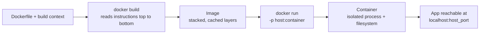

# Docker — Concepts & Notes

Docker packages an application together with everything it needs to run (interpreter, libraries, OS
packages, config) into a single, portable unit. This solves the classic "works on my machine" problem: the
Streamlit agent in this module needs a specific Python version, `build-essential` for compiling some
package's native extensions, and a fixed set of pinned dependencies — Docker guarantees whoever runs the
container gets exactly that environment, not whatever happens to be installed on their host.

Reference: https://docs.docker.com/get-started/

## Images vs. Containers

- **Image** — a read-only, layered filesystem snapshot: an OS base, plus every change a `Dockerfile`
  instruction adds on top (packages installed, files copied in). Built once, reused everywhere.
- **Container** — a running (or stopped) instance of an image, with its own writable layer on top and its
  own isolated process/network namespace. Many containers can run from the same image simultaneously,
  each with independent state.

```
image  = a class            (defines what's inside: files, packages, entrypoint)
container = an instance      (an actual running process using that image, with its own state)
```

## The Dockerfile

A `Dockerfile` is a linear, language-agnostic build script: each instruction produces a new filesystem
layer stacked on the previous one.

- **`FROM <image>`** — the base layer everything else builds on. Almost always an existing image (an OS, or
  an OS with a language runtime preinstalled), not built from scratch.
- **`WORKDIR <path>`** — sets the working directory for every instruction that follows (`COPY`, `RUN`,
  `CMD`); creates the directory if it doesn't exist.
- **`COPY <src> <dest>`** — copies files from the build context (the directory `docker build` is run from)
  into the image. Deterministic and the recommended default.
- **`ADD <src> <dest>`** — a superset of `COPY` that also auto-extracts local `.tar` archives and can fetch
  remote URLs. The extra behavior is rarely what's actually wanted, which is why `COPY` is preferred unless
  archive extraction is specifically needed.
- **`RUN <command>`** — executes a command at *build* time and commits the result as a new layer (e.g.
  installing packages). Different from `CMD`, which does not run at build time.
- **`EXPOSE <port>`** — documents which port the container listens on. It does **not** publish the port to
  the host by itself — that's a `docker run -p` responsibility (see below). Purely informational/metadata.
- **`CMD [...]`** — the default command a container runs when started, unless overridden by a command
  appended to `docker run`. A `Dockerfile` should have exactly one effective `CMD`; a later one overrides an
  earlier one rather than combining with it.
- **`ENTRYPOINT [...]`** — similar to `CMD`, but arguments passed to `docker run` are appended to it rather
  than replacing it outright. Not used in this module's `Dockerfile`, but common when a container should
  always run through one fixed executable with configurable arguments.

## Build & Run Pipeline



```
docker build -t <tag> .        # build an image from the Dockerfile in the current directory
docker run -p 8501:8501 <tag>  # start a container, mapping host port 8501 -> container port 8501
```

`-p <host_port>:<container_port>` is what actually makes a service reachable from outside the container;
`EXPOSE` in the `Dockerfile` only documents intent.

## Layer Caching

Each instruction is cached as its own layer. On a rebuild, Docker reuses cached layers for every
instruction up to the first one whose inputs changed, and rebuilds everything from that point on —
identical instructions do not repeat identical work.

```
build 1: FROM -> apt-get install -> WORKDIR -> COPY requirements.txt -> pip install -> COPY . -> CMD
                                                                                   ^ app code changes here

build 2 (only app code changed):
  FROM              -> cache hit
  apt-get install   -> cache hit
  WORKDIR           -> cache hit
  COPY requirements.txt -> cache hit (file unchanged)
  pip install       -> cache hit (same input as last time, skipped entirely)
  COPY .            -> cache MISS (files changed) -> rebuilds from here down
  CMD               -> rebuilt
```

This is why `requirements.txt` is conventionally copied and installed **before** the rest of the
application code: dependency installation (slow) stays cached across rebuilds that only touch source files
(fast), instead of reinstalling every package on every code change.

## This Module's Dockerfile

`dsa/Dockerfile` (course-provided, gitignored per this repo's `dsa_*`/`dsa` convention — see the root
`CLAUDE.md`) containerizes the Streamlit search agent:

```
FROM python:3.12                              # base image: Python 3.12 + a minimal Debian userland
RUN apt-get update && apt-get install -y build-essential
                                               # C/C++ toolchain -- some pip packages compile native
                                               # extensions during install and fail without it
WORKDIR /app                                  # everything below runs relative to /app
COPY requirements.txt .                       # copied first, on its own, for layer-caching (see above)
ADD . /app                                    # rest of the app code
RUN pip install --no-cache-dir -r requirements.txt
                                               # --no-cache-dir: don't keep pip's download cache in the
                                               # image layer -- it's dead weight once packages are installed
EXPOSE 8501                                   # Streamlit's default port; documentation only, see above
CMD ["streamlit", "run", "app.py"]             # container's default command
```

Two things worth flagging if this `Dockerfile` is revisited:

- `ADD . /app` copies the entire build context, including `requirements.txt` again — `COPY . /app` would be
  the more conventional choice here since nothing being added needs archive extraction or URL fetching.
- Running as the default `root` user is fine for local/course use, but a production image would typically
  add a non-root `USER` before the final `CMD`.

To run this app locally without a container (the more direct path for iterating on
[`streamlit_search_agent.py`](./streamlit_search_agent.py)): `streamlit run streamlit_search_agent.py`.
