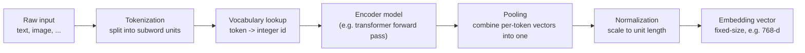
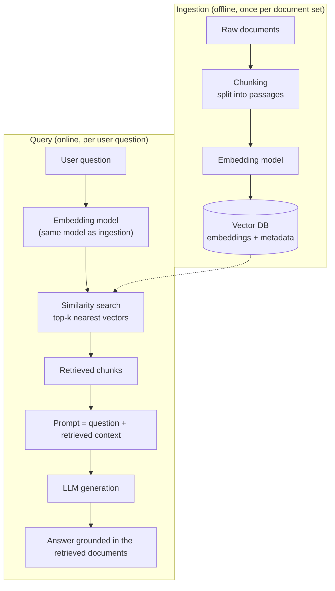

# Core concepts about Vector Databases

See [module 05](../05-prompt-engineering/vector_databases.md) for *why* retrieval-augmented generation
needs a vector store in the first place, and [`chroma.md`](../12-langchain-p1/chroma.md) for a concrete
vector database implementation. This file covers the underlying mechanics: how embeddings are produced,
how a vector database indexes and searches them, and how to choose between the available options.

## Embeddings

An **embedding** is a dense, fixed-size numeric vector that represents a discrete object — a word, a
sentence, an image, a document — as a point in a continuous, high-dimensional space. The vector isn't
arbitrary: it's produced by a model trained so that objects with similar *meaning* end up as nearby points,
and dissimilar objects end up far apart. This is what lets a computer system compare "meaning" using
ordinary geometry (distance, angle) instead of exact text matching, and it's why LLM-adjacent systems use
embeddings to capture semantic relationships between words, terms, and concepts without relying on their
exact surface form (syntax).

**Example** — a well-trained word embedding space captures relationships as consistent vector arithmetic,
not just proximity:

```
embedding("king") - embedding("man") + embedding("woman") ≈ embedding("queen")
```

At the sentence level, the same principle holds for meaning rather than wording:

```
embedding("How do I return a product I bought?")
embedding("What's the process for sending an item back?")
  -> nearly identical vectors, despite sharing almost no words
```

**How an embedding is obtained, from scratch:**



```
function get_embedding(text):
    tokens     = tokenize(text)                 # split into subword units
    token_ids  = vocabulary_lookup(tokens)       # map tokens -> integer ids
    hidden     = encoder_model(token_ids)        # one vector per token
    vector     = pool(hidden)                    # e.g. mean-pool or take the [CLS] vector -> single vector
    return normalize(vector)                     # unit length, so cosine similarity reduces to a dot product
```

The encoder is trained beforehand (e.g. by predicting masked/nearby words, or by pulling paraphrase pairs
together and unrelated pairs apart via a contrastive loss) so that the geometric structure of the output
space reflects semantic structure, not just token overlap. Once trained, `get_embedding` is a single
forward pass — no further training happens at storage or query time.

## Vector Databases

A **vector database** is a database purpose-built to store embeddings and search them by similarity —
given a query vector, it returns the stored vectors closest to it, rather than rows matching an exact
filter. It usually stores the embedding alongside the original object (text, metadata, an id pointing back
to a source document), so a search result carries back more than just a vector.

Vector databases are used in production systems for a specific combination of reasons:

- **High-dimensional data** — embeddings commonly have hundreds to thousands of dimensions; general-purpose
  databases and naive linear scans don't index or search that efficiently at scale.
- **Similarity search** — the core query pattern isn't "rows where `x = y`", it's "the *k* rows closest to
  this vector", which requires purpose-built indexing structures (see below) rather than a B-tree.
- **Scalability** — approximate nearest-neighbor (ANN) indexes trade a small amount of recall for
  sub-linear search time, which is what makes similarity search viable over millions/billions of vectors
  instead of only thousands.
- **Nearest-neighbor search** — the underlying operation RAG, semantic search, deduplication, and
  recommendation all reduce to: find the k stored items most similar to a given query point.
- **Gen AI integration** — most vector databases ship first-class support for embedding models and LLM
  frameworks (LangChain, LlamaIndex), making them the default storage layer for retrieval-augmented
  generation and agent memory rather than a general-purpose fit repurposed for the job.

### Vector embedding

What actually gets written to a vector database is the embedding plus enough context to make a search
result useful on its own:

```
insert into collection:
  id:        "doc-042"
  embedding: [0.12, 0.87, -0.03, ...]        # e.g. 768 floats
  document:  "Our return policy allows refunds within 30 days."
  metadata:  {"source": "faq.pdf", "section": "returns"}
```

Two different kinds of similarity matter here, and embeddings are deliberately built to preserve one and
discard the other:

- **Semantic relation** — closeness in *meaning*. "I'd like a refund" and "How do I get my money back?"
  should map to nearby vectors even though they share almost no words.
- **Syntactic relation** — closeness in *surface form/grammar*. "The dog bit the man" and "The man bit the
  dog" are syntactically almost identical (same words, same structure) but mean opposite things.

A good embedding model is trained to prioritize semantic similarity over syntactic similarity — which is
precisely what makes vector search useful for retrieval: a query worded completely differently from the
source document can still retrieve it, as long as the *meaning* overlaps. Storing raw text and matching on
exact substrings (i.e. traditional keyword search) has the opposite bias.

### How Vector Databases work?

1. An embedding model turns each piece of information to be stored into a vector (see the pipeline above).
2. The vector is written to the database alongside an id and any metadata, and added to an **index** — a
   data structure built specifically to make nearest-neighbor lookups fast (a plain list would force an
   exhaustive, linear-time scan over every stored vector for every query).
3. That index arranges vectors so that geometrically close vectors are also *structurally* close (e.g.
   linked in the same graph neighborhood, or hashed into the same bucket) — so a search only has to inspect
   a small, likely-relevant subset of the collection instead of comparing the query against everything.
4. Building that index is what the algorithms below actually do. Most vector databases don't compute *exact*
   nearest neighbors — they compute an *approximate* nearest-neighbor (ANN) result, trading a small amount
   of recall for a large reduction in search time.

**HNSW (Hierarchical Navigable Small World)** — builds a multi-layer graph of vectors. The top layer is
sparse, with a few long-range links acting as "highways"; each layer down is progressively denser, until
the bottom layer contains every stored vector densely connected to its true near neighbors. A search
starts at the top layer and greedily walks toward the query, dropping down a layer each time it reaches a
local optimum — so it covers large distances cheaply near the top and refines precisely near the bottom.

```
example: query lands near vector X
  layer 2 (sparse):  entry_point -> A -> X_region        (a few big jumps)
  layer 1 (denser):  X_region -> B -> C -> X_region       (medium jumps)
  layer 0 (all vecs): C -> D -> X                          (fine-grained walk to the true neighbor)
```

```
function hnsw_search(query, entry_point, layers):
    current = entry_point
    for layer in layers from top to bottom:
        current = greedy_walk(query, current, layer)   # move to the closest neighbor in this layer
                                                         # until no neighbor is closer (local optimum)
    candidates = search_layer(query, current, layer=0, breadth=ef)
    return top_k(candidates, k)
```

**LSH (Locality-Sensitive Hashing)** — uses hash functions specifically designed so that similar vectors
collide into the same bucket with high probability, and dissimilar vectors rarely do. A common construction
uses random hyperplanes: each hyperplane splits the space in two, and a vector's hash bit records which
side it falls on.

```
example: 3 random hyperplanes h1, h2, h3
  vector A -> (1, 0, 1) -> bucket "101"
  vector B -> (1, 0, 1) -> bucket "101"    (same bucket as A -> likely near A)
  vector C -> (0, 1, 0) -> bucket "010"    (different bucket -> likely far from A)
```

```
function lsh_hash(vector, hyperplanes):
    bits = [1 if dot(vector, h) >= 0 else 0 for h in hyperplanes]
    return join(bits)                          # e.g. "101" -- the bucket key

# indexing (once)
for v in all_vectors:
    hash_table[lsh_hash(v, hyperplanes)].append(v)

# query
function lsh_search(query, hyperplanes, hash_table):
    candidates = hash_table[lsh_hash(query, hyperplanes)]   # only this bucket, not the whole collection
    return exact_nearest(query, candidates)
```

**Random Projection** — a dimensionality-reduction technique: multiply each high-dimensional vector by a
random matrix to project it into a much lower-dimensional space. The Johnson–Lindenstrauss lemma guarantees
that, for a large enough target dimension, pairwise distances are approximately preserved — so search can
run on much smaller vectors with bounded distortion, then optionally refine on the original vectors.

```
example: 1024-dim embeddings -> project to 64 dims
  original vector:  1024 floats  (expensive to compare at scale)
  projected vector: 64 floats    (16x smaller, approximately the same relative distances)
```

```
R = random_matrix(rows=target_dim, cols=original_dim)   # entries ~ N(0, 1)

function random_projection(vector):
    return (1 / sqrt(target_dim)) * (R @ vector)          # scaled projection, distances approx. preserved
```

**Product Quantization (PQ)** — a compression technique: split each vector into `m` equal-length
sub-vectors, cluster each sub-vector's space independently (e.g. with k-means) into a small codebook, then
represent each sub-vector by the id of its nearest codebook centroid. A 512-byte float vector can shrink to
a handful of bytes, which is what lets an index hold billions of vectors in memory.

```
example: 128-dim vector, split into m=8 sub-vectors of 16 dims each
  each sub-vector -> nearest of 256 centroids -> 1 byte
  original size: 128 * 4 bytes = 512 bytes
  compressed:    8 * 1 byte    = 8 bytes            (64x smaller)
```

```
# training (once, offline)
for i in range(m):
    codebooks[i] = kmeans(all_subvectors[i], k=256)   # cluster each sub-space independently

# encoding a vector for storage
function pq_encode(vector):
    return [nearest_centroid(sub, codebooks[i]) for i, sub in enumerate(split(vector, m))]

# approximate distance between a query and a stored, encoded vector
function pq_distance(query, codes):
    query_subs = split(query, m)
    return sum(distance(query_subs[i], codebooks[i][codes[i]]) for i in range(m))
```

HNSW and LSH are indexing strategies (how vectors are *organized* for search); random projection and
product quantization are compression strategies (how vectors are *represented* more cheaply) — the two are
often combined, e.g. product-quantizing vectors and then indexing the compressed codes with HNSW.

### Retrieving information

To retrieve information, the query itself is embedded with the same model used to embed the stored data,
then compared against the index using one of three similarity metrics:

**Cosine similarity** — the cosine of the angle between two vectors; ignores magnitude entirely, comparing
only direction.

$$\cos(\mathbf{a}, \mathbf{b}) = \frac{\mathbf{a} \cdot \mathbf{b}}{\|\mathbf{a}\| \, \|\mathbf{b}\|}$$

```
a = [1, 2], b = [2, 4]     (b is a scaled-up copy of a -- same direction, different length)
cos(a, b) = (1*2 + 2*4) / (sqrt(5) * sqrt(20)) = 10 / 10 = 1.0   (identical direction -> max similarity)
```

**Euclidean distance (L2)** — straight-line distance between the two points; sensitive to magnitude, so two
vectors pointing the same way but of different length are *not* considered close.

$$d(\mathbf{a}, \mathbf{b}) = \sqrt{\sum_{i=1}^{n} (a_i - b_i)^2}$$

```
a = [0, 0], b = [3, 4]
d(a, b) = sqrt((0-3)^2 + (0-4)^2) = sqrt(9 + 16) = 5
```

**Dot product (inner product)** — sum of elementwise products; combines both direction and magnitude, and
is cheaper to compute than cosine similarity because it skips the normalization step.

$$\mathbf{a} \cdot \mathbf{b} = \sum_{i=1}^{n} a_i b_i$$

```
a = [1, 2], b = [3, 4]
a . b = 1*3 + 2*4 = 11
```

When embeddings are pre-normalized to unit length (as in the `get_embedding` pseudocode above), cosine
similarity and dot product produce the same ranking — which is why many vector databases default to dot
product: it's mathematically equivalent in that case, and cheaper to compute at query time over millions of
vectors.

## Vector Databases in Agentic Systems (RAG Framework)

**Retrieval-Augmented Generation (RAG)** grounds an LLM's output in retrieved external data instead of
relying solely on what the model memorized during training — see [module 05](../05-prompt-engineering/vector_databases.md#why-retrieval-augmented-generation-rag)
for why this matters (frozen training-time knowledge, limited context window, hallucination risk). A vector
database implements the retrieval half of that pipeline: documents are embedded and stored once, offline;
at query time, the question is embedded and the nearest stored chunks are pulled back and inserted into the
prompt before generation.



**Example** — a customer-support agent (see [module 10](../10-customer-service-bot/README.md)) embeds its
FAQ and policy documents once; when a user asks "Can I return a used item after 3 weeks?", that question is
embedded and matched against the stored policy chunks, and the closest one ("refunds allowed within 30
days") is inserted into the prompt so the model answers from that specific text instead of guessing at a
generic return policy.

### Long-term Memory

An LLM call is stateless on its own, and even a single conversation is bounded by the model's context
window — older turns eventually have to be dropped or summarized to keep the prompt from growing without
bound. **Long-term memory** solves a related but distinct problem: retaining information *across* sessions,
not just within the current context window.

A vector database supports this by applying the exact same retrieval mechanism used in RAG to an agent's
own history and learned facts, instead of to external documents: each fact, past exchange, or user
preference is embedded and stored as it's produced, and at the start of a new turn (potentially in a new
session, days later) the current input is embedded and used to retrieve only the memories relevant to it —
rather than replaying the entire history into every prompt.

This is a different mechanism from the thread-scoped **checkpointer** memory used in
[module 12](../12-langchain-p1/langchain_chains_memory_rag.ipynb) (`create_agent` + `InMemorySaver`):
a checkpointer persists the exact message history for one `thread_id`, for as long as that thread's state
is kept around. Vector-store long-term memory is retrieved by *similarity*, not by thread id, so it can
surface a relevant fact from a completely different conversation, and it scales to far more history than
would ever fit replayed in-context. Agentic systems benefit from this by being able to personalize
responses based on things learned in earlier sessions, avoid repeating tool calls whose results were
already learned and stored, and maintain continuity in long-running tasks that outlive any single
conversation thread.

## How to choose a Vector DB?

**Dedicated vector databases** are built around vector search as the primary workload:

- **Chroma** (see [`chroma.md`](../12-langchain-p1/chroma.md)) — open-source, easy to run embedded or as a
  server; a common default for prototyping and small-to-medium RAG projects.
- **FAISS** — a library, not a standalone database: no server, no persistence layer, no metadata filtering
  out of the box. It's extremely fast and is what several of the databases below use internally for their
  ANN index; a strong choice when embeddings fit in memory and the surrounding infrastructure (persistence,
  filtering, serving) is handled by the application itself.
- **Qdrant, Weaviate, Milvus, Pinecone** — production-oriented vector databases with built-in horizontal
  scaling, hybrid (vector + keyword) search, rich metadata filtering, and managed/hosted offerings — the
  usual choice once a project outgrows an embedded database like Chroma.

**General-purpose databases with vector support** add an ANN index on top of a database already built for
another primary workload:

- **PostgreSQL + `pgvector`** — adds a vector column type and index to ordinary Postgres tables.
- **MongoDB Atlas Vector Search** — adds vector indexes to MongoDB's document model.
- **Neo4j** — adds vector indexes alongside its native graph model, so a similarity search result can be
  combined with graph traversal in the same query.

**How to choose:**

- **Existing infrastructure** — if the application already runs Postgres, Mongo, or Neo4j for its primary
  data, adding a vector index there avoids operating a second database and keeps vector data
  transactionally consistent with the rest of the application's data. Standing up a dedicated vector
  database only pays off once vector search is a first-class, high-volume workload of its own.
- **Scale and latency** — millions-to-billions of vectors with tight latency requirements favor a dedicated,
  horizontally-scalable store (Qdrant/Weaviate/Milvus/Pinecone) over a general-purpose database's bolted-on
  vector index.
- **Hybrid search and metadata filtering needs** — how important is combining similarity search with exact
  filters (e.g. "similar products, but only in stock") or keyword search — dedicated vector databases
  generally have more mature support for this than a vector extension bolted onto another engine.
- **Hosting model** — self-hosted vs. managed changes the operational cost, independent of which engine is
  chosen; most of the dedicated options above offer both.
- **Ecosystem integration** — support in the framework already in use (e.g. LangChain retrievers, as in
  [module 12](../12-langchain-p1/langchain_chains_memory_rag.ipynb)) reduces integration work regardless of
  which database is technically "best" on paper.
