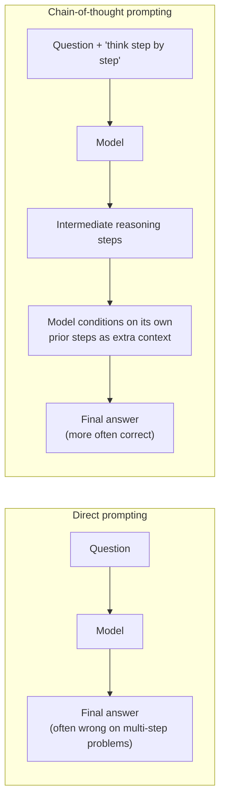

# Reasoning in LLMs

## What "Reasoning" Means Here

An LLM is trained to do one thing: predict the next token given everything before it. Most of what looks
like "understanding" is really pattern completion learned from massive repetition. **Reasoning** is the
harder case — problems that need several dependent inference steps chained together (arithmetic,
multi-hop question answering, logical deduction), where the correct final token depends on intermediate
results the model isn't directly shown at training time. A model can be excellent at fluent, plausible
next-token prediction and still fail at reasoning, because the two aren't the same skill — fluency doesn't
imply that the intermediate steps are actually being computed correctly.

## Why Arithmetic Is a Classic Reasoning Probe

Arithmetic is a convenient benchmark for reasoning because it's unambiguous (there's exactly one correct
answer, unlike open-ended text), compositional (multi-digit addition requires carrying digits — several
dependent steps, not one lookup), and trivial for a human or a calculator, which makes any failure clearly
attributable to the model rather than to task ambiguity. A model that gets `47 + 38` right by actually
carrying the 1 is doing something qualitatively different from one that gets it right because it saw that
exact sum enough times during training to memorize it — and arithmetic, unlike most language tasks, makes
that distinction testable: swap in numbers the model has never seen and see whether the pattern still
holds.

## Chain-of-Thought Prompting

The dominant technique for eliciting better reasoning from a large *pretrained* model is
**chain-of-thought (CoT) prompting**: instead of asking for the final answer directly, the prompt asks the
model to write out its intermediate steps first, and only then give the answer. This works because the
model's own previously-generated tokens become part of its input for predicting the next one — writing
"38 + 47 = 30 + 40 + 8 + 7 = 70 + 15 = 85" gives the model intermediate results to condition on that a
one-shot "the answer is 85" prompt never exposes it to.

CoT is a *prompting* technique — it doesn't change the model's weights, only what it's asked to generate
before the answer. It works well on large models with broad pretraining, precisely because they've seen
enough worked examples of step-by-step problem solving during pretraining to have learned the pattern of
"show your work" as a useful strategy. That precondition is exactly what's missing from the toy model in
this module, below.

## This Module's Toy Model: Pattern-Matching, Not Reasoning

[`tiny_addition_llm_training.ipynb`](./tiny_addition_llm_training.ipynb) trains a small GPT-2-architecture
model **from scratch** — no pretraining, no exposure to language or worked examples, no chain-of-thought —
purely on millions of randomly generated `"d + d = dd"` examples. It ends up quite accurate on 1-digit
addition, but not because it learned to *add*: it learned the statistical association between input digit
pairs and output digit tokens from sheer repetition over a narrow, fixed input format. This is visible in
exactly where it breaks: the notebook's own tokenizer rejects `"9 + 5 = 14"` because `"14"` isn't a single
token in its 13-symbol vocabulary — a two-character deviation from the exact format the model was drilled
on is enough to break it entirely, which is not what "understanding addition" would look like. A model
that had actually learned to carry digits, rather than to map input patterns to output patterns, wouldn't
be so brittle to that kind of surface variation.

This is the same gap the CoT literature responds to at a much larger scale: a large pretrained model
without CoT often gets multi-step arithmetic wrong for a similar underlying reason — it's still ultimately
doing next-token pattern completion — but has enough general capacity and pretraining exposure that
walking through intermediate steps measurably helps. The toy model here has neither the capacity nor the
pretraining to benefit from that; it illustrates the underlying problem (next-token prediction isn't
inherently computation) in its clearest, smallest form.

## Reference

[Towards Reasoning in Large Language Models: A Survey](https://arxiv.org/pdf/2212.10403) — a broader
survey of reasoning techniques and evaluation in LLMs than covered here, including chain-of-thought and
other elicitation strategies.
