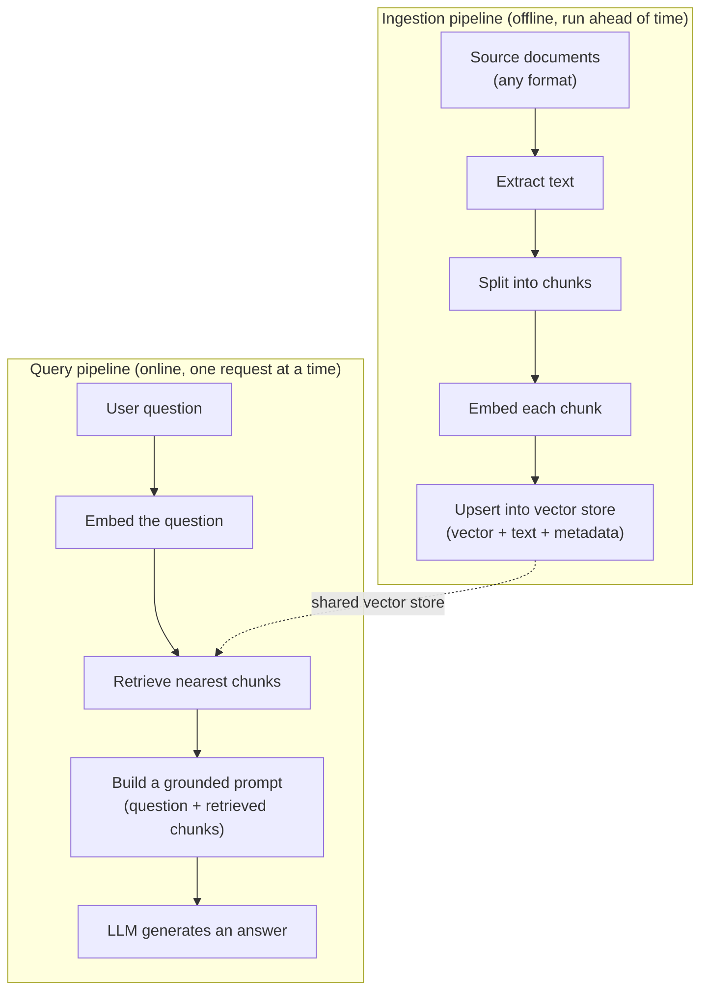

# Building RAG Applications — Reference Notes

These notes cover the *application-engineering* side of Retrieval-Augmented Generation: how to structure
an ingestion pipeline, how to chunk real documents, how to ground and cite an LLM's answers, and how to
reason about failures once the system is running. For the underlying concepts — what an embedding is, how
a vector index works, and the similarity metrics involved — see
[`vector_databases.md`](../16-vector-databases/vector_databases.md), which this doc assumes and doesn't
repeat. Everything below is written to generalize to any project, not to any one framework or vector
store; [`document_indexer.py`](./document_indexer.py), [`rag_api.py`](./rag_api.py), and
[`rag_streamlit_app.py`](./rag_streamlit_app.py) in this folder are one concrete implementation of the
pattern, referenced at the end.

## The Two-Pipeline Architecture

A RAG system is really two independent pipelines that happen to share a vector store:



Keeping these as separate, independently-runnable stages (rather than one script that does everything)
matters in practice: ingestion is slow, run rarely, and idempotent-ish (rerun on a schedule or when
documents change); the query pipeline is fast, run constantly, and must stay responsive. Coupling them
means every query pays for re-reading and re-embedding the entire corpus, which doesn't scale past a
handful of documents.

## Chunking Strategy

Documents almost never fit in a single embedding usefully — a whole PDF embedded as one vector loses the
fine-grained relevance signal that made retrieval worth doing in the first place, and won't fit an LLM's
context window as retrieved context either. So text gets split into **chunks** before embedding:

- **Chunk size** trades off two failure modes. Too large, and a chunk mixes multiple topics — its
  embedding becomes a blurry average that doesn't match *any* specific query well, and retrieving it
  wastes context-window budget on irrelevant text. Too small, and a chunk loses the surrounding context
  needed to make sense of it on its own (a sentence fragment referring to "it" with no antecedent in the
  chunk). There's no universally correct number — it depends on how self-contained a typical passage in
  the source material is; a few hundred tokens is a common practical starting point.
- **Chunk overlap** repeats the tail of one chunk at the start of the next. Without it, a fact sitting
  exactly on a chunk boundary can end up split across two chunks, with neither one containing the whole
  fact. A modest overlap (e.g. 10% of the chunk size) trades a bit of storage/embedding redundancy for
  fewer boundary losses.
- **Token-based vs. character-based splitting**: splitting by token count (matching what the embedding
  model and the LLM actually consume) keeps every chunk within a predictable budget regardless of how
  dense or verbose the source text is; splitting by character count is simpler but a chunk_size in
  characters means a wildly different number of tokens depending on the text's language and formatting.
- Beyond fixed-size splitting, **structure-aware splitting** (breaking on paragraph/section/heading
  boundaries where they exist) tends to produce more coherent chunks than blind fixed-size windows,
  at the cost of needing structure-aware parsing per document type.

## Multi-Format Ingestion

Real document collections are rarely one format. The general pattern is a **dispatch table**: pick the
extractor based on file type, run every file through it, and merge the results into the same downstream
chunking/embedding step regardless of source format:

```
for file in walk(directory):
    extractor = loaders.get(file.extension)
    if extractor is None:
        skip file
    text = extractor(file)
    chunks = split(text)
    embed_and_store(chunks, metadata={"source": file.path, ...})
```

The extractors themselves are the only format-specific part of the system — PDF text extraction, Word
paragraph extraction, slide text extraction, and so on are all interchangeable behind this dispatch table.
Attaching metadata (at minimum, the source file path) to every chunk at ingestion time is what makes
citation possible later — retrieval alone only returns text; metadata is what turns "this passage is
relevant" into "this passage is relevant, and came from *this* document."

## Citation and Grounding

Retrieval alone doesn't guarantee a *grounded* answer — an LLM can still ignore the retrieved context and
answer from its own parametric knowledge, or blend the two without indicating which is which. A simple,
model-agnostic technique for both encouraging grounding and making it auditable:

1. Number each retrieved chunk when building the prompt (`0: <chunk text>`, `1: <chunk text>`, ...).
2. Instruct the model, in the system prompt, to answer only from the provided documents and to cite the
   number of whichever chunk(s) it used, in a fixed, parseable format (e.g. `[0]`, `[1]`).
3. On the client/caller side, regex-extract those bracketed numbers out of the generated answer and map
   them back to the original chunks (and their source metadata) that were sent in.

This works with any LLM API that accepts a system prompt and returns plain text — it needs no special
"citation mode" from the provider. The trade-off is that citation compliance depends entirely on
instruction-following, not a structural guarantee: a model can still cite the wrong number, cite nothing,
or fabricate a citation for content it didn't actually use — so citations should be treated as a strong
hint for the user to verify, not as a checked fact.

## Failure Modes

When a RAG answer is wrong, the fix depends on *where* in the pipeline it went wrong:

- **Retrieval failure** — the relevant chunk was never returned to the model at all (wrong chunks
  retrieved, or the relevant information doesn't exist as a chunk due to a chunking or ingestion gap).
  Symptom: the model's answer is wrong *and* the retrieved sources shown alongside it clearly don't
  contain the answer. Fix: chunking strategy, embedding model choice, or retrieval parameters (`k`,
  filtering), not the prompt.
- **Generation failure** — the right chunks were retrieved, but the model didn't use them correctly
  (misread, misquoted, or drew the wrong conclusion from correct context). Symptom: the cited sources
  *do* contain the answer, but the generated text doesn't match them. Fix: prompt phrasing, a stronger
  model, or lower temperature.
- **Hallucination despite retrieval** — the model answers confidently from its own prior knowledge (or
  invents something) while ignoring the retrieved context entirely, sometimes even attaching a citation
  to a claim the cited chunk doesn't support. This is the case citation is meant to catch: always check
  that a citation's *content* actually supports the sentence it's attached to, not just that a citation
  exists.

Distinguishing these three by inspecting the retrieved sources (not just the final answer) is the fastest
way to know which part of the pipeline to debug.

## When This Split Is (and Isn't) Worth It

Separating ingestion, a retrieval+generation API, and a client (as in this folder's three scripts) makes
sense once more than one client needs the same retrieval backend, or the backend needs independent
scaling/deployment from the UI. For a single-user prototype or a one-off script, collapsing everything
into one process — embed, retrieve, and generate inline — is simpler and avoids the extra HTTP hop, with
no architectural loss until a second consumer or a scaling need actually shows up.
